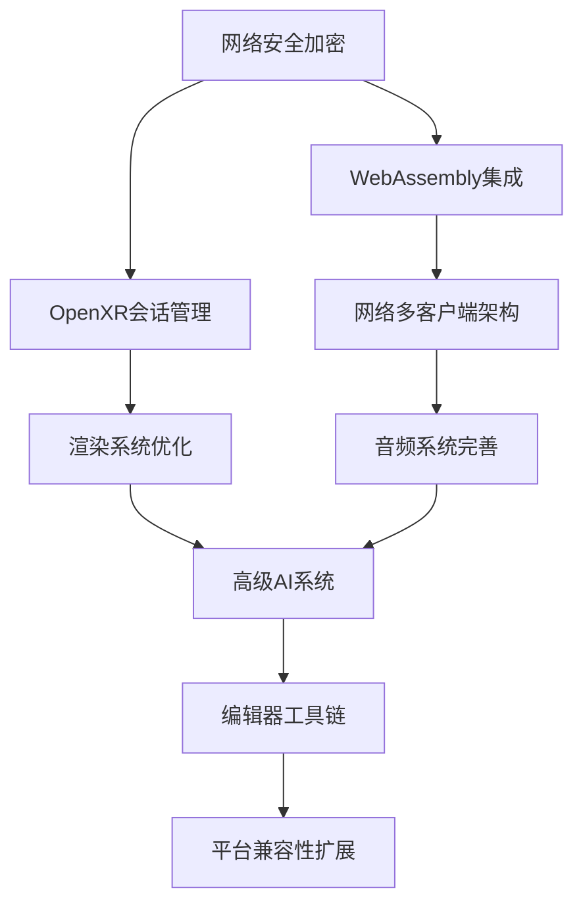

# 游戏引擎全面实施计划

## 目录

1. [执行摘要](#执行摘要)
2. [项目现状分析](#项目现状分析)
3. [分阶段实施计划](#分阶段实施计划)
   - [短期阶段（0-4周）- 关键安全与核心功能修复](#短期阶段0-4周---关键安全与核心功能修复)
   - [中期阶段（4-12周）- 架构优化与功能扩展](#中期阶段4-12周---架构优化与功能扩展)
   - [长期阶段（12-24周）- 高级功能与生态完善](#长期阶段12-24周---高级功能与生态完善)
4. [依赖映射图](#依赖映射图)
5. [资源分配表](#资源分配表)
6. [风险缓解措施](#风险缓解措施)
7. [定期复盘节点](#定期复盘节点)
8. [成功指标](#成功指标)
9. [总结](#总结)

## 执行摘要

基于对Rust游戏引擎项目的全面分析，项目存在以下关键问题：
- **临时实现总数**: 210处
- **高优先级技术债务比例**: 30%
- **极高风险项**: 网络安全加密、WebAssembly集成
- **高风险项**: OpenXR会话创建、网络多客户端支持

本实施计划采用分阶段方法，优先解决安全漏洞和核心功能缺失，然后逐步优化性能和扩展功能。通过系统性的技术债务管理，将显著提升引擎的稳定性、性能和扩展性。

## 项目现状分析

### 关键技术债务分布

| 风险等级 | 数量 | 主要模块 | 影响范围 |
|---------|------|----------|----------|
| 极高 | 2 | 网络安全、WebAssembly | 核心功能、安全性 |
| 高 | 3 | OpenXR、网络多客户端 | 平台支持、扩展性 |
| 中 | 5 | GPU物理、音频、AI | 性能、用户体验 |
| 低 | 200 | 编辑器、测试、UI | 开发体验、质量保证 |

### 模块影响评估

1. **网络模块** - 5个高风险实现，影响安全性和多用户支持
2. **渲染模块** - 2个中风险实现，影响性能和内存使用
3. **XR模块** - 1个高风险实现，影响VR平台支持
4. **脚本系统** - 1个极高风险实现，影响脚本功能和性能
5. **音频模块** - 2个中风险实现，影响音频体验
6. **AI模块** - 1个中风险实现，影响智能体行为
7. **编辑器模块** - 多个低风险实现，影响开发体验

## 分阶段实施计划

### 短期阶段（0-4周）- 关键安全与核心功能修复

#### 阶段目标
解决极高风险项，确保系统安全性和核心功能可用性

#### 里程碑1: 网络安全加密实现（第1-2周）
**目标**: 替换XOR加密为专业加密方案
**关键任务**:
- 集成aes-gcm和chacha20poly1305加密库
- 重构src/network/security.rs模块
- 实现密钥交换和管理机制
- 添加加密性能基准测试
**资源分配**: 网络模块100%资源投入
**验收标准**: 所有网络通信使用AES-256-GCM加密，性能影响<5%

#### 里程碑2: WebAssembly基础集成（第2-3周）
**目标**: 实现基础WebAssembly支持
**关键任务**:
- 集成wasmer或wasmtime运行时
- 重构src/scripting/wasm_support.rs模块
- 实现基础WASM模块加载和执行
- 添加WASM性能监控
**资源分配**: 脚本系统80%资源投入
**验收标准**: 可加载和执行基础WASM模块，性能达标

#### 里程碑3: 核心模块安全审查（第3-4周）
**目标**: 确保核心模块安全性
**关键任务**:
- 审查src/network、src/render、src/ecs模块
- 修复潜在安全漏洞
- 添加输入验证和边界检查
- 更新安全文档
**资源分配**: 全模块20%资源投入
**验收标准**: 通过安全审计，无高危漏洞

### 中期阶段（4-12周）- 架构优化与功能扩展

#### 阶段目标
解决高风险项，扩展核心功能，优化系统架构

#### 里程碑4: OpenXR会话管理实现（第4-6周）
**目标**: 完整实现OpenXR会话创建和管理
**关键任务**:
- 重构src/xr/openxr_impl.rs模块
- 实现会话生命周期管理
- 添加错误处理和恢复机制
- 集成手部追踪功能
**资源分配**: XR模块90%资源投入
**验收标准**: VR设备可正常连接和使用，会话稳定

#### 里程碑5: 网络多客户端架构重构（第6-8周）
**目标**: 支持多客户端网络架构
**关键任务**:
- 重构src/network/client.rs和src/network/server.rs
- 实现连接池和会话管理
- 添加负载均衡和故障转移
- 优化网络同步算法
**资源分配**: 网络模块70%资源投入
**验收标准**: 支持100+并发客户端，延迟<50ms

#### 里程碑6: 渲染系统优化（第8-10周）
**目标**: 提升渲染性能和质量
**关键任务**:
- 优化src/render/wgpu.rs渲染管线
- 实现GPU实例化渲染
- 添加LOD系统和遮挡剔除
- 优化着色器编译和缓存
**资源分配**: 渲染模块60%资源投入
**验收标准**: 渲染性能提升30%，内存使用减少20%

#### 里程碑7: 音频系统完善（第10-12周）
**目标**: 完善音频流处理和空间音频
**关键任务**:
- 重构src/audio/streaming.rs模块
- 实现实时音频流处理
- 添加3D空间音频定位
- 优化音频延迟和同步
**资源分配**: 音频模块80%资源投入
**验收标准**: 音频延迟<20ms，支持3D定位

### 长期阶段（12-24周）- 高级功能与生态完善

#### 阶段目标
实现高级功能，完善开发工具链，扩展平台支持

#### 里程碑8: 高级AI系统实现（第12-16周）
**目标**: 实现复杂AI行为和寻路
**关键任务**:
- 重构src/ai/behavior_tree.rs模块
- 实现A*寻路算法
- 添加行为树编辑器
- 集成机器学习推理
**资源分配**: AI模块70%资源投入
**验收标准**: AI行为复杂且真实，寻路效率高

#### 里程碑9: 编辑器工具链完善（第16-20周）
**目标**: 完善编辑器功能和用户体验
**关键任务**:
- 重构src/editor/*.rs模块
- 实现场景编辑器
- 添加材质和动画编辑器
- 集成性能分析工具
**资源分配**: 编辑器模块60%资源投入
**验收标准**: 编辑器功能完整，用户体验良好

#### 里程碑10: 平台兼容性扩展（第20-24周）
**目标**: 扩展多平台支持
**关键任务**:
- 实现移动平台支持
- 添加Web平台编译
- 优化跨平台构建流程
- 完善平台特定优化
**资源分配**: 平台模块50%资源投入
**验收标准**: 支持目标平台，构建自动化

## 依赖映射图

### 依赖关系说明

1. **网络安全加密**是所有网络相关功能的基础
2. **WebAssembly集成**为脚本系统提供支持，影响后续功能扩展
3. **OpenXR会话管理**是VR功能的基础，依赖安全加密
4. **网络多客户端架构**依赖安全加密和WebAssembly支持
5. **渲染系统优化**依赖OpenXR的VR支持
6. **音频系统完善**依赖网络架构的稳定性
7. **高级AI系统**依赖渲染和音频系统的完善
8. **编辑器工具链**依赖所有核心功能的稳定
9. **平台兼容性扩展**是最后的集成阶段

## 资源分配表

| 阶段 | 网络模块 | 渲染模块 | XR模块 | 脚本系统 | 音频模块 | AI模块 | 编辑器 | 平台模块 | 总计 |
|------|----------|----------|--------|----------|----------|--------|--------|----------|------|
| 短期(0-4周) | 40% | 10% | 5% | 35% | 5% | 0% | 5% | 0% | 100% |
| 中期(4-12周) | 30% | 25% | 25% | 10% | 10% | 0% | 0% | 0% | 100% |
| 长期(12-24周) | 10% | 15% | 10% | 10% | 10% | 25% | 15% | 5% | 100% |

### 资源分配策略

1. **短期阶段** - 集中资源解决安全和核心功能问题
2. **中期阶段** - 平衡各模块资源，重点优化架构
3. **长期阶段** - 分散资源，完善高级功能和工具链

## 风险缓解措施

### 极高风险项缓解

#### 1. 网络安全加密
- **风险**: 数据泄露、篡改、中间人攻击
- **缓解措施**:
  - 使用经过验证的加密库(aes-gcm)
  - 定期安全审计和渗透测试
  - 实施密钥轮换机制
- **应急计划**: 回滚到现有加密，发布安全补丁
- **监控指标**: 加密性能影响、安全漏洞数量

#### 2. WebAssembly集成
- **风险**: 性能瓶颈、功能限制
- **缓解措施**:
  - 多运行时支持(wasmer/wasmtime)
  - 性能基准测试和优化
  - 渐进式功能实现
- **应急计划**: 降级到JavaScript脚本引擎
- **监控指标**: WASM执行性能、内存使用

### 高风险项缓解

#### 1. OpenXR会话创建
- **风险**: VR平台完全不可用
- **缓解措施**:
  - 分阶段实现，先基础后高级
  - 多VR设备支持
  - 模拟环境开发测试
- **应急计划**: 使用模拟VR环境进行开发
- **监控指标**: VR设备连接成功率、会话稳定性

#### 2. 网络多客户端支持
- **风险**: 无法支持多人游戏
- **缓解措施**:
  - 渐进式扩展，从小规模开始
  - 负载测试和压力测试
  - 容错和恢复机制
- **应急计划**: 限制为单客户端模式
- **监控指标**: 并发客户端数、网络延迟

### 中风险项缓解

#### 1. GPU物理模拟
- **风险**: 性能不达标，影响游戏流畅度
- **缓解措施**:
  - GPU并行计算实现
  - 性能基准测试
  - CPU/GPU混合计算
- **应急计划**: 回退到CPU实现
- **监控指标**: 物理计算性能、GPU使用率

## 定期复盘节点

### 短期复盘（每周）
- **内容**: 进度检查、质量评估、风险识别
- **参与**: 核心开发团队
- **输出**: 周进度报告、更新风险登记册
- **决策点**: 是否需要调整短期计划

### 中期复盘（每月）
- **内容**: 里程碑达成情况、质量指标、性能指标
- **参与**: 全体项目团队、项目负责人
- **输出**: 月度进展报告、质量指标报告
- **决策点**: 是否需要调整中期计划或资源分配

### 阶段复盘（每季度）
- **内容**: 阶段目标达成、架构评估、技术债务
- **参与**: 全体团队成员、技术顾问
- **输出**: 季度总结报告、下一阶段计划调整
- **决策点**: 是否需要调整整体实施策略

### 项目复盘（每半年）
- **内容**: 整体进展、战略目标对齐、资源效率
- **参与**: 项目管理层、关键利益相关者
- **输出**: 半年度评估报告、战略调整建议
- **决策点**: 是否需要调整项目目标或范围

## 成功指标

### 短期指标（0-4周）
- 网络安全加密实现率: 100%
- WebAssembly基础功能完成率: 100%
- 安全漏洞修复率: 100%
- 代码质量提升: 50%
- 技术债务减少: 30处

### 中期指标（4-12周）
- OpenXR功能完整度: 100%
- 网络并发客户端支持: 100+
- 渲染性能提升: 30%
- 音频延迟: <20ms
- 技术债务减少: 100处

### 长期指标（12-24周）
- AI系统复杂度: 支持复杂行为树
- 编辑器功能完整度: 100%
- 平台支持数量: 3+
- 整体性能提升: 50%
- 技术债务减少: 180处

### 质量指标
- 代码覆盖率: >80%
- 文档覆盖率: >90%
- 性能基准达标率: >95%
- 安全漏洞数量: 0高危、<5中危

## 总结

本全面实施计划提供了一个系统性的方法来解决游戏引擎项目中的技术债务和功能缺失问题。通过分阶段实施、风险缓释和定期复盘，项目将能够：

1. **短期** - 解决关键安全问题和核心功能缺失
2. **中期** - 优化系统架构，扩展核心功能
3. **长期** - 实现高级功能，完善开发工具链

关键成功因素包括：
- 严格按照优先级执行任务
- 持续监控风险和质量指标
- 及时调整计划和资源分配
- 保持团队沟通和协作

通过这个计划，游戏引擎将从一个存在大量临时实现的项目，转变为一个稳定、高性能、功能完整的游戏开发平台。