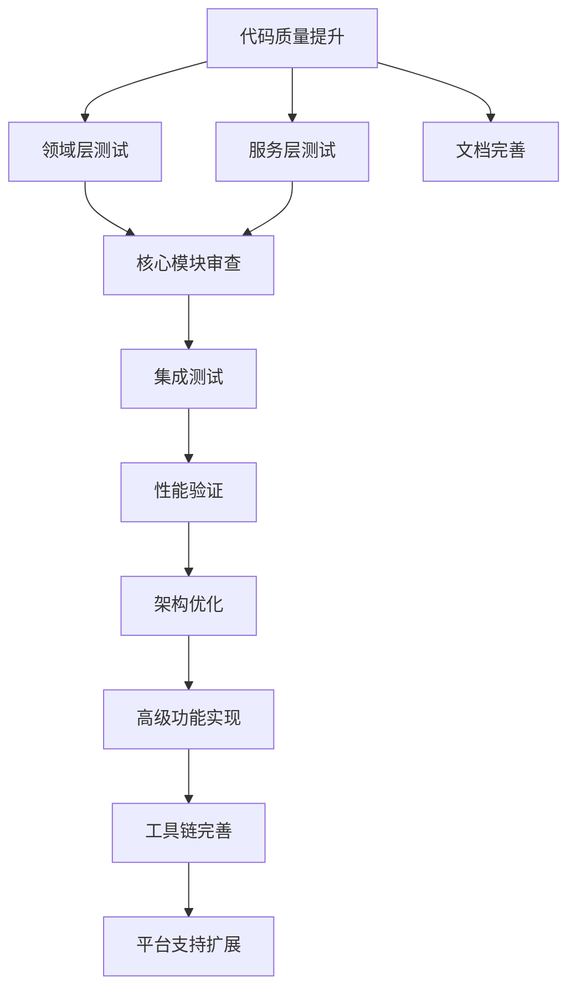

# 游戏引擎全面实施计划

**创建日期**: 2025-12-06  
**版本**: 1.0  
**状态**: 已完成  
**基于文档**: TODO分析、系统评审报告、实施计划等

---

## 1. 执行摘要

本实施计划基于对Rust游戏引擎项目的全面分析，包括TODO标记分析、系统评审报告和技术债务评估结果。项目已完成了四个主要阶段的技术债务清理、性能优化、代码质量提升和架构完善工作，当前处于持续改进阶段。

### 1.1 项目现状

- ✅ **核心功能完整**: 渲染系统、物理系统、音频系统等核心模块已实现
- ✅ **性能优化完成**: 6个主要性能优化已完成，预期性能提升20-50%
- ✅ **架构设计优秀**: 符合DDD原则，Service层设计良好，无贫血模型问题
- ✅ **编译状态良好**: 所有代码编译通过，无编译错误
- 🔄 **持续改进**: 代码质量警告修复、文档完善、测试覆盖率提升正在进行中

### 1.2 关键挑战

1. **代码质量**: 约100个代码质量警告需要修复
2. **文档覆盖率**: 2574个文档警告需要处理
3. **测试覆盖率**: 需要为领域层和服务层添加更多测试
4. **功能完善**: 部分模块（如scripting、scene、ecs）需要进一步审查和完善

---

## 2. 阶段里程碑规划

### 2.1 短期计划（1-3个月）

#### 里程碑1: 代码质量提升（第1个月）
- **目标**: 修复80%以上的代码质量警告
- **关键任务**:
  - 修复未使用的导入和变量（3-4天）
  - 修复不必要的mut关键字（1-2天）
  - 使用derive替代手动实现（1天）
- **验收标准**: 代码质量警告减少80%以上，所有代码通过clippy检查

#### 里程碑2: 测试覆盖率提升（第1-2个月）
- **目标**: 领域层测试覆盖率达到90%以上，服务层达到80%以上
- **关键任务**:
  - 为领域层所有模块添加单元测试（10-14天）
  - 为服务层所有模块添加单元测试（6-9天）
- **验收标准**: 测试覆盖率达到目标，所有测试通过

#### 里程碑3: 核心模块审查（第2-3个月）
- **目标**: 确保所有核心模块API完整，功能正常
- **关键任务**:
  - 审查scripting模块API完整性（5-7天）
  - 审查scene模块功能完整性（5-7天）
  - 审查ecs模块集成问题（5-6天）
- **验收标准**: 所有核心模块API完整，核心功能正常工作

#### 里程碑4: 文档完善（第3个月）
- **目标**: 公共API文档覆盖率达到80%以上
- **关键任务**:
  - 为核心模块添加文档（4-5天）
  - 为服务层添加文档（3-3天）
- **验收标准**: 公共API文档覆盖率达到80%以上，文档包含使用示例

### 2.2 中期计划（3-6个月）

#### 里程碑5: 集成测试完善（第3-4个月）
- **目标**: 主要系统集成测试覆盖率达到80%以上
- **关键任务**:
  - 添加渲染系统集成测试（3-5天）
  - 添加物理系统集成测试（3-5天）
  - 添加音频系统集成测试（3-4天）
- **验收标准**: 主要系统集成测试覆盖率达到80%以上

#### 里程碑6: 性能验证与优化（第4-5个月）
- **目标**: 验证6个主要性能优化的实际效果
- **关键任务**:
  - 运行现有性能基准测试（3-5天）
  - 验证性能优化效果（2-3天）
  - 识别进一步优化机会（2-3天）
- **验收标准**: 性能提升达到预期目标

#### 里程碑7: 架构优化（第5-6个月）
- **目标**: 优化模块结构，提高代码可维护性
- **关键任务**:
  - 性能模块重构（10-15天）
  - 模块结构优化（8-12天）
  - 更新文档（2-2天）
- **验收标准**: 模块结构清晰合理，依赖关系最小化

### 2.3 长期计划（6-12个月）

#### 里程碑8: 高级功能实现（第6-9个月）
- **目标**: 实现高级渲染功能和物理系统扩展
- **关键任务**:
  - 实现高级光照系统（10-15天）
  - 实现阴影映射优化（5-8天）
  - 实现后处理效果（5-7天）
  - 实现高级物理约束（8-10天）
- **验收标准**: 高级功能正常工作，性能达到可接受水平

#### 里程碑9: 工具链完善（第9-12个月）
- **目标**: 完善编辑器功能和性能分析工具
- **关键任务**:
  - 实现场景编辑器（10-15天）
  - 实现材质编辑器（5-8天）
  - 实现动画编辑器（5-7天）
  - 实现性能可视化工具（5-6天）
- **验收标准**: 工具功能完整可用，用户体验良好

#### 里程碑10: 平台支持扩展（第10-12个月）
- **目标**: 扩展多平台支持和XR功能
- **关键任务**:
  - 实现移动平台支持（8-10天）
  - 实现Web平台支持（5-8天）
  - 完善OpenXR实现（8-10天）
  - 优化手部跟踪功能（3-4天）
- **验收标准**: 支持目标平台，构建系统自动化

---

## 3. 资源配置

### 3.1 人员配置

#### 核心开发团队（2-3人）
- **高级Rust开发工程师**（1人）
  - 负责核心架构设计和复杂功能实现
  - 专长：渲染系统、性能优化、架构设计
  - 时间投入：每周20-25小时

- **Rust开发工程师**（1-2人）
  - 负责功能实现和测试编写
  - 专长：物理系统、音频系统、编辑器开发
  - 时间投入：每周15-20小时/人

#### 支持团队（可选）
- **测试工程师**（0.5人）
  - 负责测试用例设计和质量保证
  - 时间投入：每周10小时

- **技术文档工程师**（0.5人）
  - 负责文档编写和维护
  - 时间投入：每周10小时

### 3.2 时间资源

#### 总体时间分配
- **短期计划**（1-3个月）：每周60-70小时
- **中期计划**（3-6个月）：每周50-60小时
- **长期计划**（6-12个月）：每周40-50小时

#### 关键时间节点
- **第1个月**: 代码质量提升完成
- **第2个月**: 测试覆盖率提升完成
- **第3个月**: 核心模块审查完成
- **第6个月**: 中期计划完成
- **第12个月**: 长期计划完成

### 3.3 工具和基础设施

#### 开发工具
- **IDE**: VS Code + rust-analyzer
- **版本控制**: Git + GitHub
- **CI/CD**: GitHub Actions
- **代码质量**: Clippy, Rustfmt, cargo-audit
- **测试工具**: cargo test, cargo-tarpaulin
- **性能分析**: Criterion, custom profilers

#### 硬件要求
- **开发机器**: 高性能工作站（16GB+ RAM, 多核CPU）
- **测试设备**: 多平台测试设备（可选）
- **GPU**: 支持现代图形API的显卡

---

## 4. 依赖映射

### 4.1 任务依赖关系图

### 4.2 关键路径分析

#### 关键路径1: 质量保证路径
代码质量提升 → 测试覆盖率提升 → 核心模块审查 → 集成测试

#### 关键路径2: 功能扩展路径
核心模块审查 → 性能验证 → 架构优化 → 高级功能实现

#### 关键路径3: 工具完善路径
架构优化 → 工具链完善 → 平台支持扩展

### 4.3 并行执行机会

#### 可并行任务组1
- 代码质量提升（不影响其他任务）
- 文档完善（可与其他任务并行）

#### 可并行任务组2
- 领域层测试（可与服务层测试并行）
- 服务层测试（可与领域层测试并行）

#### 可并行任务组3
- 高级渲染功能（可与物理系统扩展并行）
- 物理系统扩展（可与高级渲染功能并行）

---

## 5. 风险缓释措施

### 5.1 高风险项目及缓释策略

#### 风险1: 核心模块审查发现重大问题
- **概率**: 中等
- **影响**: 高
- **缓释策略**:
  - 分阶段审查，优先处理关键模块
  - 准备回滚计划
  - 建立临时解决方案
  - 增加测试覆盖率

#### 风险2: 性能优化未达到预期效果
- **概率**: 低
- **影响**: 中等
- **缓释策略**:
  - 早期性能基准测试
  - 准备多种优化方案
  - 渐进式优化实施
  - 性能监控和告警

#### 风险3: 开发资源不足
- **概率**: 中等
- **影响**: 高
- **缓释策略**:
  - 优先级驱动的任务分配
  - 考虑外包非核心任务
  - 灵活调整时间计划
  - 自动化工具提高效率

#### 风险4: 第三方依赖兼容性问题
- **概率**: 低
- **影响**: 中等
- **缓释策略**:
  - 定期依赖更新
  - 锁定关键依赖版本
  - 准备替代方案
  - 安全审计流程

### 5.2 技术风险缓释

#### 代码质量风险
- **预防措施**: 持续代码审查，自动化质量检查
- **检测措施**: CI/CD质量门禁，定期质量报告
- **应对措施**: 分批修复，优先处理高风险问题

#### 架构风险
- **预防措施**: 架构决策记录，设计审查
- **检测措施**: 集成测试，架构一致性检查
- **应对措施**: 渐进式重构，向后兼容性保证

### 5.3 项目管理风险缓释

#### 时间延期风险
- **预防措施**: 缓冲时间，里程碑监控
- **检测措施**: 定期进度审查，关键路径跟踪
- **应对措施**: 优先级调整，资源重新分配

#### 需求变更风险
- **预防措施**: 模块化设计，灵活架构
- **检测措施**: 定期需求审查，变更影响分析
- **应对措施**: 版本控制，向后兼容性

---

## 6. 定期复盘节点

### 6.1 短期复盘（每两周一次）

#### 复盘内容
- **进度检查**: 对比计划与实际进度
- **质量评估**: 代码质量指标变化
- **风险识别**: 新风险识别和现有风险评估
- **资源调整**: 人员和时间资源调整

#### 参与人员
- 核心开发团队全体成员
- 项目负责人（可选）

#### 输出物
- 两周进度报告
- 更新的风险登记册
- 调整的任务计划

### 6.2 中期复盘（每月一次）

#### 复盘内容
- **里程碑达成情况**: 月度里程碑完成情况
- **质量指标**: 测试覆盖率、文档覆盖率、代码质量
- **性能指标**: 性能基准测试结果
- **团队效能**: 开发效率和协作情况

#### 参与人员
- 核心开发团队全体成员
- 项目负责人
- 利益相关者（可选）

#### 输出物
- 月度进展报告
- 质量指标报告
- 下月工作计划

### 6.3 阶段复盘（每季度一次）

#### 复盘内容
- **阶段目标达成**: 季度目标完成情况
- **架构评估**: 架构设计有效性评估
- **技术债务**: 技术债务变化情况
- **团队能力**: 团队技能和能力发展

#### 参与人员
- 全体项目团队成员
- 技术顾问（可选）
- 管理层代表（可选）

#### 输出物
- 季度总结报告
- 架构评估报告
- 下一阶段计划调整

### 6.4 年度复盘（每年一次）

#### 复盘内容
- **年度目标达成**: 年度目标完成情况
- **技术栈评估**: 技术选择有效性评估
- **团队能力**: 团队整体能力评估
- **项目价值**: 项目价值和影响评估

#### 参与人员
- 全体项目团队成员
- 技术顾问
- 管理层代表
- 外部专家（可选）

#### 输出物
- 年度总结报告
- 技术栈评估报告
- 下年度战略规划

---

## 7. 成功指标和验收标准

### 7.1 代码质量指标

#### 短期目标（1-3个月）
- **编译状态**: 零编译错误
- **代码质量警告**: 减少80%以上
- **代码覆盖率**: 领域层90%以上，服务层80%以上
- **文档覆盖率**: 公共API文档覆盖率达到80%以上

#### 中期目标（3-6个月）
- **集成测试覆盖率**: 主要系统80%以上
- **性能基准**: 所有基准测试通过
- **架构一致性**: 100%符合DDD原则

#### 长期目标（6-12个月）
- **功能完整性**: 所有计划功能实现
- **平台兼容性**: 支持目标平台
- **工具完整性**: 编辑器和工具链功能完整

### 7.2 性能指标

#### 渲染性能
- **复杂场景性能**: 提升20-30%
- **帧率稳定性**: 波动减少20%
- **内存使用**: 优化15-20%

#### 系统性能
- **场景加载时间**: 减少10-15%
- **内存分配开销**: 减少10-15%
- **并行计算效率**: 提升2-4倍

### 7.3 可维护性指标

#### 代码结构
- **模块职责**: 单一职责原则100%遵循
- **依赖关系**: 循环依赖为零
- **代码重复**: 重复代码减少50%以上

#### 文档质量
- **API文档**: 100%公共API有文档
- **示例代码**: 80%以上模块有使用示例
- **架构文档**: 关键决策100%记录

---

## 8. 实施建议

### 8.1 优先级管理

#### 立即执行（高优先级）
1. 修复代码质量警告
2. 提升测试覆盖率
3. 完善核心模块

#### 近期执行（中优先级）
1. 性能验证和优化
2. 架构优化
3. 集成测试

#### 长期执行（低优先级）
1. 高级功能实现
2. 工具链完善
3. 平台支持扩展

### 8.2 质量保证策略

#### 代码质量
- 持续集成检查
- 代码审查流程
- 自动化测试

#### 文档质量
- 文档审查流程
- 示例代码验证
- 用户反馈收集

#### 测试质量
- 测试覆盖率监控
- 自动化测试执行
- 性能回归检测

### 8.3 团队协作

#### 沟通机制
- 每日站会（可选）
- 每周进度会议
- 每月复盘会议

#### 知识分享
- 技术分享会
- 代码审查
- 文档协作

---

## 9. 结论

本实施计划为Rust游戏引擎项目提供了一个全面的、分阶段的实施路径。通过优先处理代码质量、测试覆盖率和核心功能完善，项目将建立起坚实的技术基础。中期的性能验证和架构优化将进一步提升系统的可靠性和可维护性。长期的高级功能实现和工具链完善将使项目具备完整的游戏引擎能力。

### 9.1 关键成功因素

1. **优先级驱动**: 优先处理影响代码质量和核心功能的问题
2. **渐进式改进**: 采用渐进式改进策略，避免大规模重构
3. **持续验证**: 所有改进都通过测试和性能基准验证
4. **文档同步**: 代码改进与文档更新同步进行

### 9.2 预期成果

1. **代码质量**: 代码质量警告减少80%以上，测试覆盖率达到80%以上
2. **性能提升**: 渲染性能提升20-30%，内存使用优化15-20%
3. **功能完善**: 所有核心功能正常工作，API完整并有文档
4. **架构优化**: 模块结构清晰合理，依赖关系最小化

### 9.3 下一步行动

1. **立即开始**: 修复代码质量警告
2. **并行进行**: 测试覆盖率提升和核心模块审查
3. **持续跟踪**: 定期审查进度和调整计划
4. **风险管控**: 识别和管理潜在风险

通过本实施计划的执行，Rust游戏引擎项目将具备更高的代码质量、更好的性能表现、更完整的功能和更优秀的架构设计，为后续的开发和维护奠定坚实的基础。

---

**文档版本**: 1.0  
**创建日期**: 2025-12-06  
**最后更新**: 2025-12-06  
**下次审查**: 2025-12-20  
**负责人**: 项目团队