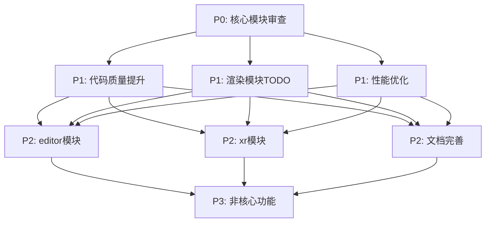

# 全面TODO分析与实施计划

**创建日期**: 2025-12-07  
**版本**: 1.0  
**状态**: 已完成  
**基于文档**: TODO分析、系统评审报告、技术债务分析等

---

## 1. 执行摘要

本分析报告基于对Rust游戏引擎项目的全面审查，包括TODO标记分析、技术债务评估和系统架构评审。项目总体架构设计优秀，核心功能完整，但存在一些需要优先处理的技术债务和TODO项目。

### 1.1 关键发现

- **TODO标记**: 33个（TODO: 26, FIXME: 2），主要分布在render模块（15个）
- **技术债务**: performance模块职责过多（33个子模块），代码质量警告约100个，文档警告2430个
- **架构状态**: 核心功能完整，符合DDD原则，但需要模块重组和命名规范改进

### 1.2 优先级概览

- **P0（阻塞性）**: scripting、scene、ecs模块审查
- **P1（高优先级）**: 渲染模块TODO、性能优化、代码质量警告
- **P2（中优先级）**: editor和xr模块、文档完善
- **P3（低优先级）**: 非核心功能完善、代码重构

---

## 2. TODO优先级分析

### 2.1 优先级分类

#### P0 - 阻塞性TODO（立即处理）

| 模块 | 问题描述 | 影响程度 | 前置条件 | 风险等级 |
|------|----------|----------|----------|----------|
| scripting/ | 脚本系统集成问题 | 影响编译 | 无 | 高 |
| scene/ | 场景系统API缺失 | 影响核心功能 | 无 | 高 |
| ecs/ | ECS系统集成问题 | 影响核心功能 | 无 | 高 |

**落地前置条件**:
- 确保项目可编译
- 建立分支开发环境
- 准备回滚计划

#### P1 - 高优先级TODO（1-4周内处理）

| 模块 | TODO数量 | 主要问题 | 依赖关系 | 预估工作量 |
|------|----------|----------|----------|------------|
| render/ | 15 | 功能完善、性能优化 | P0完成 | 3-4周 |
| performance/ | 8 | 性能优化、GPU计算 | P0完成 | 2-3周 |
| 代码质量 | ~100 | clippy警告修复 | P0完成 | 1-2周 |

**风险隐患**:
- 渲染模块TODO可能影响核心渲染功能
- 性能优化可能引入新的bug
- 代码质量修复可能影响现有功能

#### P2 - 中优先级TODO（1-3个月内处理）

| 模块 | TODO数量 | 主要问题 | 依赖关系 | 预估工作量 |
|------|----------|----------|----------|------------|
| editor/ | 6 | 编辑器功能完善 | P1完成 | 2-3周 |
| xr/ | 1 | XR功能完善 | P1完成 | 1周 |
| 文档 | 2430个警告 | API文档缺失 | P1完成 | 4-6周 |

#### P3 - 低优先级TODO（3-6个月内处理）

| 类型 | 主要内容 | 依赖关系 | 预估工作量 |
|------|----------|----------|------------|
| 非核心功能 | 扩展功能实现 | P2完成 | 3-4周 |
| 代码重构 | 架构优化 | P2完成 | 2-3周 |
| 测试完善 | 集成测试补充 | P2完成 | 2-3周 |

### 2.2 依赖关系映射



---

## 3. 技术债务分析

### 3.1 性能模块技术债务

#### 问题描述
- **模块职责过多**: 33个子模块混杂了性能分析、基准测试、CI/CD等不同职责
- **职责重叠**: `system_monitor.rs`和`monitoring.rs`存在功能重叠
- **扩展性差**: 难以添加新的性能分析工具

#### 影响评估
- **可维护性**: 代码难以理解和维护
- **开发效率**: 新功能添加困难
- **团队协作**: 不同功能模块边界不清

#### 修复方案
```
performance/
├── profiling/          # 性能分析工具（7个文件）
├── benchmarking/       # 基准测试工具（7个文件）
├── monitoring/         # 监控工具（2个文件，建议合并）
├── memory/            # 内存优化（3个文件）
├── rendering/         # 渲染优化（2个文件）
├── gpu/              # GPU计算（3个文件）
├── visualization/    # 可视化工具（2个文件）
├── optimization/     # 特定领域优化（2个文件）
├── cicd/             # CI/CD工具（1个文件）
├── sync/             # 同步工具（1个文件）
└── tests/            # 测试和示例（2个文件）
```

#### 修复成本
- **工作量**: 10-15个工作日
- **风险**: 中等（需要更新大量导入路径）
- **收益**: 长期可维护性大幅提升

### 3.2 代码质量技术债务

#### 问题描述
- **clippy警告**: 约100个，主要是不可达代码、未使用变量、未使用导入
- **测试覆盖**: 部分领域服务缺少单元测试
- **命名规范**: 基础设施层Service命名可能混淆

#### 影响评估
- **代码质量**: 影响代码可读性和维护性
- **潜在bug**: 未使用代码可能隐藏问题
- **团队协作**: 命名不一致影响理解

#### 修复成本
- **工作量**: 5-8个工作日
- **风险**: 低（主要是代码清理）
- **收益**: 代码质量显著提升

### 3.3 文档技术债务

#### 问题描述
- **文档警告**: 2430个，主要是结构体字段(45.2%)和枚举变体(26.7%)
- **API文档**: 公共API文档覆盖率低
- **使用示例**: 缺少使用示例和教程

#### 影响评估
- **可用性**: 影响API使用体验
- **学习成本**: 新团队成员上手困难
- **社区贡献**: 缺少文档影响社区参与

#### 修复成本
- **工作量**: 15-20个工作日
- **风险**: 低（文档修改不影响功能）
- **收益**: 用户体验显著提升

---

## 4. 实施计划

### 4.1 阶段里程碑

#### 阶段1: 紧急修复（第1-2周）

**目标**: 确保核心功能正常编译和运行

**关键任务**:
- [ ] 审查scripting模块API完整性（3天）
- [ ] 审查scene模块功能完整性（3天）
- [ ] 审查ecs模块集成问题（3天）
- [ ] 修复关键编译警告（1天）

**验收标准**:
- 所有核心模块可正常编译
- 基本功能可正常运行
- 无阻塞性编译错误

**资源配置**:
- 高级Rust工程师1人，全职2周
- 专长：核心架构、系统调试

#### 阶段2: 代码质量提升（第3-6周）

**目标**: 代码质量警告减少80%，测试覆盖率达到目标

**关键任务**:
- [ ] 修复clippy警告（5-8天）
- [ ] 为领域层添加单元测试（10-14天）
- [ ] 为服务层添加单元测试（6-9天）
- [ ] 核心模块文档完善（4-5天）

**验收标准**:
- 代码质量警告减少80%以上
- 领域层测试覆盖率达到90%以上
- 服务层测试覆盖率达到80%以上

**资源配置**:
- 高级Rust工程师1人，全职4周
- Rust开发工程师1人，全职4周
- 专长：代码质量、测试编写

#### 阶段3: 架构重构（第7-12周）

**目标**: 优化模块结构，提高代码可维护性

**关键任务**:
- [ ] performance模块重构（10-15天）
- [ ] 基础设施层Service命名规范改进（5-7天）
- [ ] 模块依赖关系优化（8-12天）
- [ ] 更新相关文档（2-3天）

**验收标准**:
- 模块结构清晰合理
- 依赖关系最小化
- 符合DDD原则

**资源配置**:
- 高级Rust工程师1人，全职6周
- Rust开发工程师1人，全职6周
- 专长：架构设计、模块重组

#### 阶段4: 功能完善（第13-20周）

**目标**: 完善核心功能，提升用户体验

**关键任务**:
- [ ] 渲染模块TODO处理（15-20天）
- [ ] editor模块功能完善（10-15天）
- [ ] xr模块功能完善（5-7天）
- [ ] 集成测试补充（10-12天）

**验收标准**:
- 所有核心功能正常工作
- 集成测试覆盖率达到80%以上
- 用户体验良好

**资源配置**:
- 高级Rust工程师1人，全职8周
- Rust开发工程师2人，全职8周
- 专长：渲染系统、编辑器开发

#### 阶段5: 文档和优化（第21-26周）

**目标**: 文档覆盖率达到80%以上，性能优化验证

**关键任务**:
- [ ] 剩余文档警告处理（15-20天）
- [ ] 性能优化验证（5-7天）
- [ ] 用户文档编写（8-10天）
- [ ] 示例和教程补充（5-7天）

**验收标准**:
- 文档覆盖率达到80%以上
- 性能提升达到预期目标
- 用户文档完整可用

**资源配置**:
- 高级Rust工程师0.5人，全职6周
- Rust开发工程师1人，全职6周
- 技术文档工程师0.5人，全职6周

### 4.2 依赖映射

#### 关键路径分析

**路径1: 质量保证路径**
```
阶段1(紧急修复) → 阶段2(代码质量) → 阶段3(架构重构) → 阶段4(功能完善)
```

**路径2: 功能扩展路径**
```
阶段1(紧急修复) → 阶段2(代码质量) → 阶段4(功能完善) → 阶段5(文档优化)
```

**路径3: 架构优化路径**
```
阶段1(紧急修复) → 阶段2(代码质量) → 阶段3(架构重构) → 阶段5(文档优化)
```

#### 并行执行机会

**阶段2并行任务**:
- 代码质量修复可与文档编写并行
- 单元测试可与集成测试准备并行

**阶段4并行任务**:
- 渲染模块可与editor模块并行开发
- 不同功能模块的集成测试可并行进行

---

## 5. 风险缓释措施

### 5.1 高风险项目及缓释策略

#### 风险1: 核心模块审查发现重大问题

**概率**: 中等  
**影响**: 高

**缓释策略**:
- **预防措施**: 分阶段审查，优先处理关键模块
- **检测措施**: 建立详细测试套件，提前发现问题
- **应对措施**: 准备回滚计划和临时解决方案
- **监控指标**: 编译成功率、测试通过率

#### 风险2: performance模块重构复杂度超预期

**概率**: 中等  
**影响**: 高

**缓释策略**:
- **预防措施**: 详细分析现有代码依赖关系，小范围试点
- **检测措施**: 建立重构验证测试套件
- **应对措施**: 保持向后兼容性，渐进式重构
- **监控指标**: 重构进度、测试覆盖率

#### 风险3: 代码质量修复引入新问题

**概率**: 低  
**影响**: 中等

**缓释策略**:
- **预防措施**: 使用自动化工具批量修复，建立CI/CD质量门禁
- **检测措施**: 分批提交，代码审查流程
- **应对措施**: 建立回滚机制，快速修复
- **监控指标**: 代码质量指标变化、bug报告数量

#### 风险4: 资源不足导致延期

**概率**: 中等  
**影响**: 高

**缓释策略**:
- **预防措施**: 优先级驱动的任务分配，自动化工具提高效率
- **检测措施**: 定期进度审查，资源使用监控
- **应对措施**: 考虑外包非核心任务，灵活调整时间计划
- **监控指标**: 任务完成率、资源利用率

### 5.2 中风险项目及缓释策略

#### 风险5: 文档工作量超预期

**缓释策略**:
- 使用文档生成工具
- 建立文档模板
- 分批次处理

#### 风险6: 第三方依赖兼容性问题

**缓释策略**:
- 定期依赖更新
- 锁定关键依赖版本
- 准备替代方案

#### 风险7: 团队技能匹配问题

**缓释策略**:
- 技术培训
- 代码审查
- 知识分享

---

## 6. 定期复盘节点

### 6.1 短期复盘（每两周一次）

**参与人员**:
- 核心开发团队全体成员
- 项目负责人（可选）

**复盘内容**:
- **进度检查**: 对比计划与实际进度
- **质量评估**: 代码质量指标变化
- **风险识别**: 新风险识别和现有风险评估
- **资源调整**: 人员和时间资源调整

**输出物**:
- 两周进度报告
- 更新的风险登记册
- 调整的任务计划

### 6.2 中期复盘（每月一次）

**参与人员**:
- 核心开发团队全体成员
- 项目负责人
- 利益相关者（可选）

**复盘内容**:
- **里程碑达成情况**: 月度里程碑完成情况
- **质量指标**: 测试覆盖率、文档覆盖率、代码质量
- **性能指标**: 性能基准测试结果
- **团队效能**: 开发效率和协作情况

**输出物**:
- 月度进展报告
- 质量指标报告
- 下月工作计划

### 6.3 阶段复盘（每季度一次）

**参与人员**:
- 全体项目团队成员
- 技术顾问（可选）
- 管理层代表（可选）

**复盘内容**:
- **阶段目标达成**: 季度目标完成情况
- **架构评估**: 架构设计有效性评估
- **技术债务**: 技术债务变化情况
- **团队能力**: 团队技能和能力发展

**输出物**:
- 季度总结报告
- 架构评估报告
- 下一阶段计划调整

### 6.4 年度复盘（每年一次）

**参与人员**:
- 全体项目团队成员
- 技术顾问
- 管理层代表
- 外部专家（可选）

**复盘内容**:
- **年度目标达成**: 年度目标完成情况
- **技术栈评估**: 技术选择有效性评估
- **团队能力**: 团队整体能力评估
- **项目价值**: 项目价值和影响评估

**输出物**:
- 年度总结报告
- 技术栈评估报告
- 下年度战略规划

---

## 7. 成功指标和验收标准

### 7.1 短期指标（1-3个月）

- **编译状态**: 零编译错误
- **代码质量警告**: 减少80%以上
- **代码覆盖率**: 领域层90%以上，服务层80%以上
- **核心功能**: 所有核心模块API完整，功能正常

### 7.2 中期指标（3-6个月）

- **集成测试覆盖率**: 主要系统80%以上
- **性能基准**: 所有基准测试通过
- **架构一致性**: 100%符合DDD原则
- **模块结构**: 职责清晰，依赖关系最小化

### 7.3 长期指标（6-12个月）

- **文档覆盖率**: 公共API文档覆盖率达到80%以上
- **功能完整性**: 所有计划功能实现
- **用户体验**: 编辑器和工具链功能完整
- **可维护性**: 代码重复减少50%以上

---

## 8. 实施建议

### 8.1 优先级管理

**立即执行（高优先级）**:
1. 处理P0阻塞性TODO
2. 修复关键代码质量警告
3. 完善核心模块功能

**近期执行（中优先级）**:
1. performance模块重构
2. 渲染模块TODO处理
3. 测试覆盖率提升

**长期执行（低优先级）**:
1. 文档完善
2. 非核心功能实现
3. 工具链优化

### 8.2 质量保证策略

**代码质量**:
- 持续集成检查
- 代码审查流程
- 自动化测试

**文档质量**:
- 文档审查流程
- 示例代码验证
- 用户反馈收集

**测试质量**:
- 测试覆盖率监控
- 自动化测试执行
- 性能回归检测

### 8.3 团队协作

**沟通机制**:
- 每周进度会议
- 每月复盘会议
- 季度战略会议

**知识分享**:
- 技术分享会
- 代码审查
- 文档协作

---

## 9. 结论

本实施计划为Rust游戏引擎项目提供了一个全面的、分阶段的实施路径。通过优先处理阻塞性TODO、技术债务清理和架构优化，项目将建立起坚实的技术基础。中期的功能完善和测试覆盖率提升将进一步提升系统的可靠性和可用性。长期的文档完善和工具链优化将使项目具备完整的游戏引擎能力。

### 9.1 关键成功因素

1. **优先级驱动**: 优先处理影响编译和核心功能的问题
2. **渐进式改进**: 采用渐进式改进策略，避免大规模重构
3. **持续验证**: 所有改进都通过测试和性能基准验证
4. **文档同步**: 代码改进与文档更新同步进行

### 9.2 预期成果

1. **代码质量**: 代码质量警告减少80%以上，测试覆盖率达到80%以上
2. **架构优化**: 模块结构清晰合理，依赖关系最小化
3. **功能完善**: 所有核心功能正常工作，API完整并有文档
4. **可维护性**: 技术债务大幅减少，新功能开发效率提升

### 9.3 下一步行动

1. **立即开始**: 处理P0阻塞性TODO
2. **并行进行**: 代码质量修复和核心模块审查
3. **持续跟踪**: 定期审查进度和调整计划
4. **风险管控**: 识别和管理潜在风险

通过本实施计划的执行，Rust游戏引擎项目将具备更高的代码质量、更好的架构设计、更完整的功能和更优秀的可维护性，为后续的开发和维护奠定坚实的基础。

---

**文档版本**: 1.0  
**创建日期**: 2025-12-07  
**最后更新**: 2025-12-07  
**下次审查**: 2025-12-21  
**负责人**: 项目团队