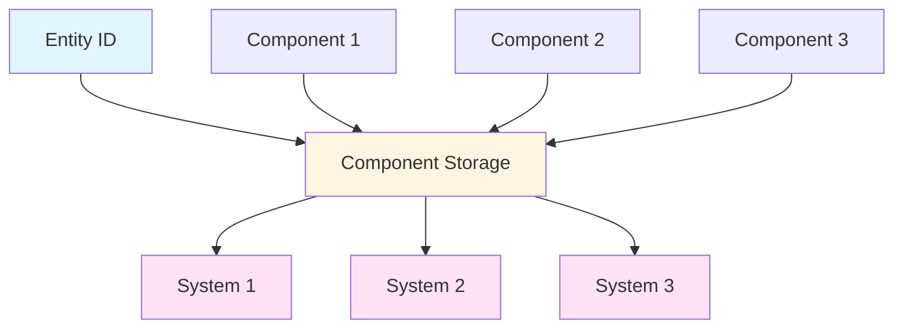

# ECS (Entity Component System) API

## Overview

The Entity Component System (ECS) is the core architectural pattern of the game engine. It provides high performance and flexibility through data-oriented design.



## Core Concepts

### Entities

Entities are unique identifiers (IDs) that represent game objects. They are lightweight (just a number) and have no data themselves.

```rust
use game_engine::ecs::Entity;

// Create an entity
let entity = world.create_entity();

// Entity is just an ID
println!("Entity ID: {:?}", entity);

// Entities are Copy and cheap to pass around
let entity_copy = entity;
```

### Components

Components are plain data structs that hold information about entities.

```rust
use game_engine::ecs::Component;
use nalgebra::{Vector3, UnitQuaternion};

// Position component
#[derive(Component, Debug)]
struct Position {
    x: f32,
    y: f32,
    z: f32,
}

// Velocity component
#[derive(Component, Debug)]
struct Velocity {
    dx: f32,
    dy: f32,
    dz: f32,
}

// Health component
#[derive(Component)]
struct Health {
    current: u32,
    maximum: u32,
}

// Transform component (built-in)
#[derive(Component)]
struct Transform {
    position: Vector3<f32>,
    rotation: UnitQuaternion<f32>,
    scale: Vector3<f32>,
}
```

### Systems

Systems contain logic that operates on components. They query for entities with specific components and process them.

```rust
use game_engine::ecs::System;

struct MovementSystem;

impl System for MovementSystem {
    fn update(&mut self, world: &mut World, delta_time: f32) {
        // Query all entities with Position and Velocity
        for (entity, position, velocity) in world.query::<(&mut Position, &Velocity)>() {
            position.x += velocity.dx * delta_time;
            position.y += velocity.dy * delta_time;
            position.z += velocity.dz * delta_time;
        }
    }
}
```

## Working with Entities

### Creating Entities

```rust
// Create a new entity
let entity = world.create_entity();

// Create an entity with components in one call
let entity = world.create_entity()
    .with(Position { x: 0.0, y: 0.0, z: 0.0 })
    .with(Velocity { dx: 1.0, dy: 0.0, dz: 0.0 })
    .build();
```

### Adding Components

```rust
// Add a single component
world.add_component(entity, Position { x: 0.0, y: 0.0, z: 0.0 });

// Add multiple components
world.add_component(entity, Velocity { dx: 1.0, dy: 0.0, dz: 0.0 });
world.add_component(entity, Health { current: 100, maximum: 100 });
```

### Removing Components

```rust
// Remove a specific component
world.remove_component::<Velocity>(entity);

// Remove all components from entity
world.despawn(entity);
```

### Checking Components

```rust
// Check if entity has a component
if world.has_component::<Position>(entity) {
    // Entity has Position
}

// Get a component (returns Option)
if let Some(position) = world.get_component::<Position>(entity) {
    println!("Position: {:?}", position);
}

// Get a mutable component
if let Some(position) = world.get_component_mut::<Position>(entity) {
    position.x += 1.0;
}
```

## Querying Entities

### Basic Queries

```rust
// Query all entities with a specific component
for (entity, position) in world.query::<&Position>() {
    println!("Entity {:?} at ({}, {}, {})", entity, position.x, position.y, position.z);
}

// Query with multiple components
for (entity, (position, velocity)) in world.query::<(&Position, &Velocity)>() {
    println!("Entity {:?} moving at ({}, {}, {})",
        entity, velocity.dx, velocity.dy, velocity.dz);
}

// Query with mutable components
for (entity, mut position) in world.query::<&mut Position>() {
    position.x += 1.0;
}
```

### Query Options

```rust
// Optional components
for (entity, position, maybe_velocity) in world.query::<(&Position, Option<&Velocity>)>() {
    if let Some(velocity) = maybe_velocity {
        // Entity has both Position and Velocity
    } else {
        // Entity has only Position
    }
}

// Filter entities
for (entity, position, health) in world.query::<(&Position, &Health)>()
    .filter(|e| e.1.x > 0.0)  // Only entities with x > 0
{
    // Process entity
}
```

### Advanced Queries

```rust
// Query with component borrowing rules
for (entity, (position, mut velocity)) in world.query::<(&Position, &mut Velocity)>() {
    // Can read position and write to velocity
}

// Nested queries (use with care)
for (entity1, position1) in world.query::<&Position>() {
    for (entity2, position2) in world.query::<&Position>() {
        if entity1 != entity2 {
            // Calculate distance
        }
    }
}
```

## Component Storage

### Component Storage Types

Components can use different storage strategies based on access patterns:

```rust
use game_engine::ecs::{Component, ComponentStorage};

// Default storage (Vec-like)
#[derive(Component)]
#[component(storage = "Vec")]
struct VecStorageComponent {
    data: Vec<f32>,
}

// HashMap storage (sparse)
#[derive(Component)]
#[component(storage = "HashMap")]
struct SparseComponent {
    flag: bool,
}

// BTreeMap storage (sorted)
#[derive(Component)]
#[component(storage = "BTreeMap")]
struct SortedComponent {
    priority: u32,
}
```

### Component Relationships

```rust
// One-to-one: Each entity has one of each component
world.add_component(player, Position::default());
world.add_component(player, Health::default());

// One-to-many: Entity has one "main" component but references others
#[derive(Component)]
struct Inventory {
    items: Vec<Entity>,  // References to item entities
}

// Many-to-one: Multiple entities share a common component
#[derive(Component)]
struct Team {
    team_id: u32,
}
```

## Systems

### System Types

```rust
use game_engine::ecs::{System, SystemType};

// Simple system
struct SimpleSystem;

impl System for SimpleSystem {
    fn update(&mut self, world: &mut World, delta_time: f32) {
        // System logic
    }
}

// System with dependencies
struct DependentSystem;

impl System for DependentSystem {
    fn dependencies(&self) -> Vec<SystemType> {
        vec![SystemType::of::<PhysicsSystem>()]
    }

    fn update(&mut self, world: &mut World, delta_time: f32) {
        // Runs after PhysicsSystem
    }
}
```

### System Registration

```rust
// Add system to engine
engine.add_system(MovementSystem);
engine.add_system(PhysicsSystem);
engine.add_system(RenderSystem);

// Systems run in order of registration
```

### System Resources

Systems can access shared resources:

```rust
struct InputSystem {
    input_handle: InputHandle,
}

impl InputSystem {
    fn new(input_handle: InputHandle) -> Self {
        Self { input_handle }
    }
}

impl System for InputSystem {
    fn update(&mut self, world: &mut World, delta_time: f32) {
        // Access input through handle
        if self.input_handle.is_key_pressed(KeyCode::W) {
            // Move forward
        }
    }
}
```

## Events

### Component Events

```rust
// Listen for component additions
world.on_component_add(|entity, component: &Position| {
    println!("Added Position to entity {:?}", entity);
});

// Listen for component removals
world.on_component_remove(|entity, component_type| {
    println!("Removed component {:?} from entity {:?}", component_type, entity);
});

// Listen for entity despawn
world.on_entity_despawn(|entity| {
    println!("Entity {:?} despawned", entity);
});
```

## Advanced Patterns

### Entity Relationships

```rust
// Parent-child relationships
#[derive(Component)]
struct Parent {
    entity: Entity,
}

#[derive(Component)]
struct Children {
    entities: Vec<Entity>,
}

// Create hierarchy
let parent = world.create_entity();
let child1 = world.create_entity();
let child2 = world.create_entity();

world.add_component(child1, Parent { entity: parent });
world.add_component(child2, Parent { entity: parent });
world.add_component(parent, Children { entities: vec![child1, child2] });
```

### Tagging Entities

```rust
// Use empty components as tags
#[derive(Component)]
struct Player;

#[derive(Component)]
struct Enemy;

#[derive(Component)]
struct Projectile;

// Query by tag
for (entity, _) in world.query::<&Player>() {
    // This is a player entity
}
```

### Component Bundles

```rust
// Group commonly-used components
trait ComponentBundle {
    fn add_to_world(self, world: &mut World) -> Entity;
}

struct PlayerBundle {
    position: Position,
    velocity: Velocity,
    health: Health,
    player: Player,
}

impl ComponentBundle for PlayerBundle {
    fn add_to_world(self, world: &mut World) -> Entity {
        let entity = world.create_entity();
        world.add_component(entity, self.position);
        world.add_component(entity, self.velocity);
        world.add_component(entity, self.health);
        world.add_component(entity, self.player);
        entity
    }
}

// Use bundle
let player = PlayerBundle {
    position: Position::default(),
    velocity: Velocity::default(),
    health: Health { current: 100, maximum: 100 },
    player: Player,
}.add_to_world(world);
```

## Performance Tips

### Cache-Friendly Design

```rust
// Good: Components with simple data types
#[derive(Component)]
struct Transform {
    position: Vector3<f32>,
    rotation: Quaternion<f32>,
    scale: Vector3<f32>,
}

// Avoid: Components with complex nested structures
#[derive(Component)]
struct ComplexData {
    // HashMaps and Vecs can hurt cache performance
    data: HashMap<String, Vec<f32>>,
}
```

### Query Optimization

```rust
// Good: Query only what you need
for (entity, position) in world.query::<&Position>() {
    // Only read position
}

// Avoid: Querying too many components
for (entity, (pos, vel, acc, health, mana, stamina)) in world.query::<(&Position, &Velocity, &Acceleration, &Health, &Mana, &Stamina)>() {
    // This query is slower
}
```

### Entity Limits

```rust
// Reserve entity capacity upfront
world.reserve_entities(1000);

// Pre-allocate component storage
world.register_component::<Position>(1000);
```

## Complete Example

```rust
use game_engine::prelude::*;

fn main() -> Result<(), Box<dyn std::error::Error>> {
    let mut engine = Engine::new()?;

    // Create entities
    setup_world(&mut engine.world);

    // Add systems
    engine.add_system(MovementSystem);
    engine.add_system(HealthRegenSystem);
    engine.add_system(CombatSystem);

    engine.run()
}

fn setup_world(world: &mut World) {
    // Create player
    let player = world.create_entity();
    world.add_component(player, Position { x: 0.0, y: 0.0, z: 0.0 });
    world.add_component(player, Velocity { dx: 0.0, dy: 0.0, dz: 0.0 });
    world.add_component(player, Health { current: 100, maximum: 100 });
    world.add_component(player, Player);

    // Create enemies
    for i in 0..10 {
        let enemy = world.create_entity();
        world.add_component(enemy, Position {
            x: (i as f32) * 2.0,
            y: 0.0,
            z: 0.0,
        });
        world.add_component(enemy, Health { current: 50, maximum: 50 });
        world.add_component(enemy, Enemy);
    }
}

struct MovementSystem;

impl System for MovementSystem {
    fn update(&mut self, world: &mut World, delta_time: f32) {
        for (entity, mut position, velocity) in world.query::<(&mut Position, &Velocity)>() {
            position.x += velocity.dx * delta_time;
            position.y += velocity.dy * delta_time;
            position.z += velocity.dz * delta_time;
        }
    }
}

// ... other systems
```

## See Also

- [Engine API](./engine.md) - Core engine API
- [Rendering API](./rendering.md) - Rendering components and systems
- [Physics API](./physics.md) - Physics components and systems
- [Architecture Overview](../architecture/ecs.md) - ECS architecture details
