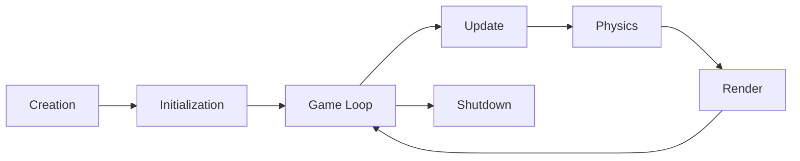

# Engine API

## Core Engine

The `Engine` is the main entry point for your game. It manages the game loop, ECS world, resources, and all subsystems.

### Creating an Engine

#### Basic Engine

```rust
use game_engine::Engine;

fn main() -> Result<(), Box<dyn std::error::Error>> {
    let mut engine = Engine::new();
    engine.run()
}
```

#### Engine with Configuration

```rust
use game_engine::{Engine, Config};

fn main() -> Result<(), Box<dyn std::error::Error>> {
    let config = Config {
        target_fps: 60,
        window_size: (1920, 1080),
        window_title: "My Game".to_string(),
        vsync: true,
        ..Default::default()
    };

    let mut engine = Engine::with_config(config)?;
    engine.run()
}
```

### Configuration Options

```rust
pub struct Config {
    // Frame rate settings
    pub target_fps: u32,
    pub vsync: bool,

    // Window settings
    pub window_size: (u32, u32),
    pub window_title: String,
    pub resizable: bool,
    pub fullscreen: bool,

    // Rendering settings
    pub multisampling: u16,
    pub shadow_quality: ShadowQuality,

    // Physics settings
    pub physics_ticks_per_second: u32,
    pub gravity: Vector3<f32>,

    // Audio settings
    pub audio_device_name: Option<String>,
}
```

### Engine Lifecycle

The engine follows this lifecycle:



#### Initialization Phase

```rust
let mut engine = Engine::new();

// Custom initialization
engine.initialize()?;

// Access systems before game loop
engine.world.create_entity();
engine.resources.load::<Texture>("player.png")?;
```

#### Game Loop Phase

The game loop runs automatically when you call `engine.run()`:

```rust
engine.run()?; // Blocks until the window is closed
```

#### Manual Game Loop

For more control, use a manual game loop:

```rust
loop {
    // Process input
    engine.handle_events()?;

    // Exit if window closed
    if engine.should_exit() {
        break;
    }

    // Update game logic
    engine.update(delta_time)?;

    // Render frame
    engine.render()?;

    // Control frame rate
    engine.limit_fps();
}

engine.shutdown()?;
```

### World Management

Access the ECS world directly:

```rust
// Get mutable reference to world
let world = &mut engine.world;

// Create entities
let entity = world.create_entity();
world.add_component(entity, Transform::default());
world.add_component(entity, Mesh::from_cube());

// Query entities
for (entity, transform) in world.query::<&Transform>() {
    println!("Entity {:?} at {:?}", entity, transform.position);
}
```

### Resource Management

Load and manage resources:

```rust
// Load a texture
let texture = engine.resources.load::<Texture>("player.png")?;

// Load a 3D model
let model = engine.resources.load::<Model>("player.gltf")?;

// Load audio
let sound = engine.resources.load::<Sound>("jump.wav")?;

// Get loaded resource
if let Some(texture) = engine.resources.get::<Texture>("player.png") {
    // Use texture
}
```

### Accessing Subsystems

#### Rendering System

```rust
// Get rendering system
let renderer = &mut engine.renderer;

// Set clear color
renderer.set_clear_color(Color::new(0.1, 0.1, 0.1, 1.0));

// Enable/disable features
renderer.set_vsync(true);
renderer.set_multisampling(4);
```

#### Physics System

```rust
// Get physics system
let physics = &mut engine.physics;

// Set gravity
physics.set_gravity(Vector3::new(0.0, -9.81, 0.0));

// Create physics bodies
let body = physics.create_rigidBody(RigidBodyType::Dynamic);
let collider = physics.create_collider(ColliderShape::Cuboid { half_extents: Vector3::new(1.0, 1.0, 1.0) });
```

#### Audio System

```rust
// Get audio system
let audio = &mut engine.audio;

// Play music
audio.play_music("background.mp3", true)?;

// Play sound effect
audio.play_sound("explosion.wav")?;

// Set volume
audio.set_master_volume(0.7);
```

#### Input System

```rust
// Get input system
let input = &engine.input;

// Check keyboard
if input.is_key_pressed(KeyCode::W) {
    // Move forward
}

// Check mouse
if input.is_mouse_button_pressed(MouseButton::Left) {
    // Shoot
}

// Get mouse position
let pos = input.mouse_position();

// Check gamepad
if let Some(gamepad) = input.gamepad(0) {
    if gamepad.is_button_pressed(GamepadButton::A) {
        // Jump
    }
}
```

### Error Handling

All engine operations return `Result<T, EngineError>`:

```rust
use game_engine::EngineError;

fn main() -> Result<(), EngineError> {
    let mut engine = Engine::new();

    engine.initialize()
        .map_err(|e| {
            eprintln!("Initialization failed: {}", e);
            e
        })?;

    engine.run()
}
```

#### Error Types

```rust
pub enum EngineError {
    InitializationFailed(String),
    ResourceLoadError(String),
    RenderingError(String),
    PhysicsError(String),
    AudioError(String),
    NetworkError(String),
    ConfigError(String),
}
```

### Performance Monitoring

Monitor engine performance:

```rust
// Get FPS
let fps = engine.fps();
println!("FPS: {}", fps);

// Get frame time
let frame_time = engine.frame_time();
println!("Frame time: {:.2}ms", frame_time);

// Get memory usage
let memory = engine.memory_usage();
println!("Memory: {:.2}MB", memory);

// Enable profiling
engine.enable_profiling(true);
```

### Custom Systems

Add custom game systems:

```rust
use game_engine::System;

struct GamePlaySystem {
    score: u32,
}

impl System for GamePlaySystem {
    fn update(&mut self, world: &mut World, delta_time: f32) {
        // Update game logic
        for (entity, player, transform) in world.query::<(&Player, &mut Transform)>() {
            // Move player
        }
    }
}

// Register system
engine.add_system(GamePlaySystem { score: 0 });
```

### Engine Events

Listen to engine events:

```rust
use game_engine::Event;

engine.set_event_callback(|event| {
    match event {
        Event::KeyDown { key } => {
            println!("Key pressed: {:?}", key);
        }
        Event::MouseMotion { x, y } => {
            println!("Mouse moved: {}, {}", x, y);
        }
        Event::WindowResized { width, height } => {
            println!("Window resized: {}x{}", width, height);
        }
        _ => {}
    }
});
```

### Saving and Loading

Save and load game state:

```rust
// Save game state
let save_data = engine.serialize_state()?;
std::fs::write("save.json", save_data)?;

// Load game state
let save_data = std::fs::read_to_string("save.json")?;
engine.deserialize_state(&save_data)?;
```

## Complete Example

Here's a complete example showing all major features:

```rust
use game_engine::prelude::*;

fn main() -> Result<(), Box<dyn std::error::Error>> {
    // Create engine with configuration
    let config = Config {
        target_fps: 60,
        window_size: (1920, 1080),
        window_title: "My Game".to_string(),
        vsync: true,
        ..Default::default()
    };

    let mut engine = Engine::with_config(config)?;

    // Initialize engine
    engine.initialize()?;

    // Create game entities
    setup_scene(&mut engine)?;

    // Run game loop
    engine.run()?;

    // Cleanup
    engine.shutdown()?;

    Ok(())
}

fn setup_scene(engine: &mut Engine) -> Result<(), Box<dyn std::error::Error>> {
    let world = &mut engine.world;

    // Create player
    let player = world.create_entity();
    world.add_component(player, Transform::position(0.0, 0.0, 0.0));
    world.add_component(player, Mesh::from_cube());
    world.add_component(player, Material::default());
    world.add_component(player, Player::new());

    // Create camera
    let camera = world.create_entity();
    world.add_component(camera, Transform::position(0.0, 2.0, 5.0));
    world.add_component(camera, Camera::new());

    // Load resources
    engine.resources.load::<Texture>("player.png")?;
    engine.audio.play_music("background.mp3", true)?;

    Ok(())
}
```

## See Also

- [ECS API](./ecs.md) - Entity Component System details
- [Resources API](./resources.md) - Resource management
- [Rendering API](./rendering.md) - Rendering system
- [Physics API](./physics.md) - Physics simulation
- [Audio API](./audio.md) - Audio system
- [Networking API](./networking.md) - Multiplayer networking
- [Configuration Guide](../configuration.md) - Configuration options
