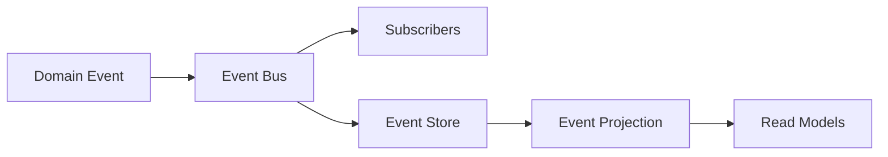

# 游戏引擎架构概览

## 概述

本游戏引擎采用现代化的分层架构设计，结合了领域驱动设计（DDD）、微内核架构和事件驱动架构的优势，提供高性能、可扩展的游戏开发框架。

## 设计原则

### 1. 关注点分离（Separation of Concerns）
- **领域层** - 纯业务逻辑，不依赖技术实现
- **应用层** - 用例编排和流程控制
- **基础设施层** - 技术实现（渲染、物理、音频等）
- **接口层** - API和用户交互

### 2. 依赖倒置（Dependency Inversion）
- 高层模块不依赖低层模块，都依赖抽象
- 通过依赖注入（DI）实现解耦
- 使用trait定义抽象接口

### 3. 单一职责（Single Responsibility）
- 每个模块只负责一个明确的功能
- 通过微内核架构实现模块化
- 插件系统支持功能扩展

### 4. 开放封闭（Open/Closed）
- 对扩展开放 - 通过插件添加新功能
- 对修改封闭 - 核心稳定不变
- 使用trait和多态实现扩展点

## 整体架构

```
┌─────────────────────────────────────────────────────────────┐
│                        接口层 (Interface)                    │
│  ┌──────────────┐  ┌──────────────┐  ┌──────────────┐      │
│  │   CLI/Editor │  │   Scripting  │  │   Network API│      │
│  └──────────────┘  └──────────────┘  └──────────────┘      │
└─────────────────────────────────────────────────────────────┘
                              │
                              ▼
┌─────────────────────────────────────────────────────────────┐
│                        应用层 (Application)                  │
│  ┌──────────────┐  ┌──────────────┐  ┌──────────────┐      │
│  │  Game Loop   │  │   Use Cases  │  │  Workflows   │      │
│  └──────────────┘  └──────────────┘  └──────────────┘      │
└─────────────────────────────────────────────────────────────┘
                              │
                              ▼
┌─────────────────────────────────────────────────────────────┐
│                        领域层 (Domain)                       │
│  ┌──────────────┐  ┌──────────────┐  ┌──────────────┐      │
│  │   Entities   │  │ Value Objs   │  │  Aggregates  │      │
│  ├──────────────┤  ├──────────────┤  ├──────────────┤      │
│  │Domain Services│  │Domain Events │  │   CQRS       │      │
│  └──────────────┘  └──────────────┘  └──────────────┘      │
└─────────────────────────────────────────────────────────────┘
                              │
                              ▼
┌─────────────────────────────────────────────────────────────┐
│                    基础设施层 (Infrastructure)               │
│  ┌──────────────┐  ┌──────────────┐  ┌──────────────┐      │
│  │   Rendering  │  │   Physics    │  │    Audio     │      │
│  ├──────────────┤  ├──────────────┤  ├──────────────┤      │
│  │     ECS      │  │  Resources   │  │   Plugins    │      │
│  └──────────────┘  └──────────────┘  └──────────────┘      │
└─────────────────────────────────────────────────────────────┘
```

## 核心架构模式

### 1. 微内核架构（Microkernel）

```
┌──────────────────────────────────────┐
│           Microkernel Core           │
│  - Scheduler                         │
│  - Service Registry                  │
│  - Message Bus                       │
│  - Plugin Manager                    │
└──────────────────────────────────────┘
         │              │              │
         ▼              ▼              ▼
    ┌────────┐    ┌────────┐    ┌────────┐
    │Plugin 1│    │Plugin 2│    │Plugin N│
    │Render  │    │Physics │    │Network │
    └────────┘    └────────┘    └────────┘
```

**优势：**
- 核心最小化，易于维护
- 插件可独立开发和部署
- 支持动态加载和卸载
- 易于测试和模拟

### 2. ECS架构（Entity Component System）

```
World
├── Entities (ID)
│   ├── Entity 1
│   ├── Entity 2
│   └── Entity 3
├── Components (Data)
│   ├── Transform
│   ├── Velocity
│   └── Sprite
└── Systems (Logic)
    ├── MovementSystem
    ├── RenderSystem
    └── PhysicsSystem
```

**数据布局优化：**
- **SoA (Structure of Arrays)** - 缓存友好
- **脏标记追踪** - 仅同步变化的组件
- **批量处理** - 并行执行

### 3. CQRS + Event Sourcing

```
Command Side                   Query Side
┌──────────────┐              ┌──────────────┐
│  Commands    │              │   Queries    │
│      ↓       │              │      ↓       │
│ Validate     │              │ Read Model   │
│      ↓       │              │(Optimized)   │
│ Execute      │              └──────────────┘
│      ↓                           ▲
│ Emit Events ─────────────────────┤
│      ↓                           │
│ Event Store                      │
└──────────────┘                   │
     ▲                             │
     │───────── Rebuild ───────────┘
```

**优势：**
- 读写分离优化性能
- 完整的审计日志
- 时间旅行调试
- 易于复制和同步

## 关键组件

### 1. 引擎核心（Engine Core）

```rust
pub struct Engine {
    world: World,              // ECS世界
    resources: Resources,      // 全局资源
    schedule: Schedule,        // 系统调度
    plugin_registry: PluginRegistry, // 插件管理
}
```

**职责：**
- 初始化和关闭
- 主循环驱动
- 资源管理
- 插件加载

### 2. 渲染系统（Rendering）

```rust
pub struct Renderer {
    backend: WGPUBackend,      // WebGPU后端
    graph: RenderGraph,        // 渲染图
    pipeline_cache: Cache,     // 管线缓存
    batcher: DrawBatcher,      // 批处理
}
```

**管线：**
- 前向渲染 / 延迟渲染
- GPU驱动渲染
- 阴影级联（CSM）
- 后处理效果

### 3. 物理系统（Physics）

```rust
pub struct PhysicsWorld {
    rigid_bodies: RigidBodySet,
    colliders: ColliderSet,
    joints: JointSet,
    broad_phase: BroadPhase,
    narrow_phase: NarrowPhase,
}
```

**特性：**
- 刚体动力学
- 软体物理
- 空间分区（BVH、哈希）
- GPU加速计算

### 4. 资源管理（Resources）

```rust
pub struct ResourceManager {
    loader: AsyncLoader,
    cache: ResourceCache,
    hot_reload: HotReloadSystem,
}
```

**特性：**
- 异步加载
- LRU缓存
- 热重载
- 引用计数

## 数据流

### 渲染流程


### 物理流程


### 事件流程



## 性能优化

### 1. 并行执行
- 多线程系统调度
- 并行for_each查询
- 无锁数据结构

### 2. 内存优化
- 对象池减少分配
- SoA布局提高缓存命中率
- 预分配和复用

### 3. GPU优化
- 间接绘制
- GPU剔除
- 计算着色器

### 4. 延迟加载
- 按需加载资源
- 流式音频
- 动态LOD

## 扩展点

### 1. 插件系统
```rust
pub trait Plugin {
    fn build(&self, app: &mut App) -> Result<(), Error>;
    fn name(&self) -> &str;
}
```

### 2. 系统扩展
```rust
pub trait System {
    fn run(&mut self, world: &mut World, resources: &Resources);
}
```

### 3. 渲染扩展
```rust
pub trait RenderPass {
    fn execute(&mut self, encoder: &mut CommandEncoder);
}
```

## 测试策略

### 单元测试
- 每个模块独立测试
- Mock外部依赖
- 快速执行

### 集成测试
- 模块间交互测试
- 使用test fixtures
- 验证接口契约

### 性能测试
- 基准测试（Criterion）
- 性能回归检测
- 内存泄漏检测

## 相关文档

- [ECS架构详解](./ecs.md)
- [渲染管线](./rendering.md)
- [物理系统](./physics.md)
- [领域层设计](./domain.md)
- [架构决策记录](../adr/README.md)
