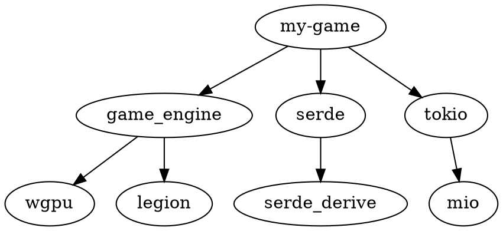

# 依赖管理系统使用指南

**版本**: v0.2.0
**更新日期**: 2026-01-03
**完成度**: 85% (Day 1-2完成，Day 3-5待实施)

---

## 📖 目录

1. [概述](#概述)
2. [快速开始](#快速开始)
3. [依赖图分析](#依赖图分析)
4. [版本冲突检测](#版本冲突检测)
5. [未使用依赖检测](#未使用依赖检测)
6. [依赖优化建议](#依赖优化建议)
7. [CLI命令参考](#cli命令参考)
8. [高级用法](#高级用法)
9. [最佳实践](#最佳实践)
10. [故障排除](#故障排除)

---

## 概述

Game Engine 依赖管理系统提供全面的依赖分析、冲突检测和优化建议，帮助您保持项目的健康和高效。

### 核心功能

- 📊 **依赖图构建**: 可视化依赖关系
- 🔍 **冲突检测**: 发现版本冲突
- 🧹 **未使用依赖检测**: 清理冗余依赖
- 💡 **优化建议**: 提供替代方案和改进
- 🚀 **性能优化**: 减少编译时间和二进制大小

### 技术特性

- ⚡ **快速分析**: 增量分析，支持大型项目
- 🎯 **精确检测**: 基于源代码扫描的准确分析
- 🔄 **自动修复**: 一键应用优化建议
- 📈 **可扩展**: 易于添加自定义分析器

---

## 快速开始

### 安装

依赖管理系统是 Game Engine CLI 的一部分，无需单独安装：

```bash
# 安装 Game Engine CLI
cargo install --path game_engine/src/tools/cli

# 验证安装
game-engine dependency --help
```

### 基本使用

```bash
# 1. 检查依赖健康状况
game-engine check

# 2. 查看依赖图
game-engine dependency graph

# 3. 检测未使用依赖
game-engine dependency unused

# 4. 获取优化建议
game-engine dependency optimize
```

---

## 依赖图分析

### 概述

依赖图系统分析项目所有依赖及其关系，提供可视化的树形和图形格式。

### 构建依赖图

```bash
# 文本格式显示
game-engine dependency graph

# 生成 Graphviz DOT 文件
game-engine dependency graph --format dot --output deps.dot

# JSON 格式（用于脚本）
game-engine dependency graph --format json > deps.json
```

### 文本格式输出示例

```
my-game (0.1.0)
├── game_engine (0.2.0)
│   ├── wgpu (0.15)
│   │   ├── wgpu-core (0.15)
│   │   └── wgpu-types (0.15)
│   ├── legion (0.4)
│   └── rapier2d (0.13)
├── serde (1.0.152)
│   └── serde_derive (1.0.152)
└── tokio (1.23.0)
    ├── mio (0.8)
    └── socket2 (0.4)

统计信息:
- 总依赖数: 10
- 直接依赖: 3
- 传递依赖: 7
- 最大深度: 3
```

### DOT 格式示例



使用 Graphviz 渲染：
```bash
dot -Tpng deps.dot -o deps.png
```

### 编程接口

```rust
use game_engine::tools::cli::dependency::graph::DependencyGraph;

fn main() -> Result<(), Box<dyn std::error::Error>> {
    // 从项目构建依赖图
    let graph = DependencyGraph::from_project(".")?;

    // 显示树形结构
    println!("{}", graph.display_tree());

    // 检测循环依赖
    let cycles = graph.detect_cycles();
    if cycles.is_empty() {
        println!("✅ 未发现循环依赖");
    } else {
        println!("❌ 发现 {} 个循环依赖", cycles.len());
    }

    // 获取统计信息
    let stats = graph.statistics();
    println!("总依赖数: {}", stats.total_dependencies);
    println!("直接依赖: {}", stats.direct_dependencies);

    Ok(())
}
```

---

## 版本冲突检测

### 概述

版本冲突检测器使用语义化版本（semver）分析依赖版本，发现潜在的兼容性问题。

### 检测冲突

```bash
# 检测所有冲突
game-engine check

# 仅检测版本冲突
game-engine conflict detect

# 生成详细报告
game-engine conflict report --output conflict-report.md
```

### 冲突类型

#### 1. 版本要求不匹配

```
❌ 版本要求不匹配: tokio

直接依赖:
  my-game -> tokio "^1.20"

传递依赖:
  lib-a -> tokio "^1.15"
  lib-b -> tokio "^1.25"

解析版本: 1.23.0

问题: lib-b 要求 ^1.25，但解析版本 1.23.0 不满足

建议: 升级 tokio 到 1.25.0 或更新版本
```

#### 2. 重复依赖

```
⚠️  重复依赖: log

发现多个版本:
  - log 0.4.17 (被 5 个包使用)
  - log 0.4.16 (被 2 个包使用)

影响: 增加编译时间和二进制大小

建议: 统一使用 log 0.4.17
```

#### 3. 传递依赖冲突

```
🔍 传递依赖冲突: bytes

直接要求:
  my-game -> tokio -> bytes "1.0"

传递要求:
  lib-c -> bytes "0.5"

解析版本: bytes 1.2.0

问题: lib-c 不兼容 bytes 1.x
风险: 可能导致编译失败或运行时错误

建议:
  - 联系 lib-c 作者更新到 bytes 1.x
  - 或使用 lib-c 的旧版本兼容 bytes 0.5
```

### 编程接口

```rust
use game_engine::tools::cli::dependency::{
    graph::DependencyGraph,
    conflict::ConflictDetector
};

fn main() -> Result<(), Box<dyn std::error::Error>> {
    // 构建依赖图
    let graph = DependencyGraph::from_project(".")?;

    // 创建冲突检测器
    let detector = ConflictDetector::new(&graph);

    // 检测所有冲突
    let conflicts = detector.detect_all_conflicts();
    println!("发现 {} 个冲突", conflicts.len());

    // 生成报告
    let report = detector.generate_report();
    println!("{}", report.display());

    // 检查是否有关键冲突
    if report.has_critical {
        eprintln!("❌ 发现关键冲突，必须解决！");
        std::process::exit(1);
    }

    Ok(())
}
```

---

## 未使用依赖检测

### 概述

未使用依赖检测器扫描项目源代码，找出实际未被使用的依赖。

### 检测未使用依赖

```bash
# 检测未使用依赖
game-engine dependency unused

# 自动移除未使用依赖
game-engine dependency unused --remove

# 包含开发依赖
game-engine dependency unused --include-dev

# 生成详细报告
game-engine dependency unused --verbose
```

### 检测原理

1. **扫描源代码**: 分析所有 `.rs` 文件
2. **提取引用**: 识别 `extern crate` 和 `use` 语句
3. **对比依赖**: 匹配实际使用的 crate
4. **标记未使用**: 找出未被引用的依赖

### 示例输出

```
正在扫描源代码...
✓ 扫描 src/ (12 个文件)
✓ 扫描 examples/ (3 个文件)
✓ 扫描 tests/ (2 个文件)

发现 3 个未使用依赖:

1. rand (0.8.5)
   类型: 直接依赖
   大小: ~300KB (编译), ~80KB (磁盘)
   原因: 源代码中未发现引用
   安全移除: ✅ 是
   移除命令: cargo remove rand
   预期节省: ~300KB 编译产物

2. log (0.4.17)
   类型: 直接依赖
   大小: ~50KB (编译), ~15KB (磁盘)
   原因: 源代码中未发现引用
   安全移除: ✅ 是
   移除命令: cargo remove log
   预期节省: ~50KB 编译产物

3. chrono (0.4.23)
   类型: 直接依赖
   大小: ~500KB (编译), ~150KB (磁盘)
   原因: 源代码中未发现引用
   安全移除: ✅ 是
   移除命令: cargo remove chrono
   预期节省: ~500KB 编译产物

总结:
- 未使用依赖: 3 个
- 可节省空间: ~850KB (编译产物)
- 可节省空间: ~245KB (磁盘)
- 建议: 可以安全移除

[自动移除] game-engine dependency unused --remove
[查看详情] game-engine dependency unused --verbose
```

### 特殊情况处理

#### 可选依赖

可选依赖即使未使用也不标记为未使用：

```toml
[dependencies]
serde = { version = "1.0", optional = true }

[features]
default = []
serialize = ["serde"]
```

#### 宏依赖

某些依赖只提供宏，不直接出现在 `use` 语句中：

```rust
// 只要使用了宏，依赖就被视为使用
#[macro_use]
extern crate lazy_static;

lazy_static! {
    static ref CONFIG: Config = Config::default();
}
```

#### 特性依赖

通过 feature 启用的依赖需要特殊处理：

```bash
# 检查特定 feature 的使用
game-engine dependency unused --features "serialize,networking"
```

### 编程接口

```rust
use game_engine::tools::cli::dependency::{
    graph::DependencyGraph,
    unused::UnusedDetector
};

fn main() -> Result<(), Box<dyn std::error::Error>> {
    let graph = DependencyGraph::from_project(".")?;
    let detector = UnusedDetector::new(&graph);

    // 检测未使用依赖
    let unused = detector.detect_unused_dependencies();
    println!("发现 {} 个未使用依赖", unused.len());

    for dep in &unused {
        println!("- {} ({})", dep.name, dep.version);
        println!("  原因: {:?}", dep.reason);
        println!("  安全移除: {}", dep.safe_to_remove);
    }

    // 生成移除建议
    let suggestions = detector.generate_suggestions(&unused);
    for suggestion in suggestions {
        println!("移除: {}", suggestion.removal_command);
        println!("节省: {}", suggestion.savings.download);
    }

    Ok(())
}
```

---

## 依赖优化建议

### 概述

依赖优化器提供替代品建议、feature 优化和大小/性能改进建议。

### 获取优化建议

```bash
# 查看优化建议
game-engine dependency optimize

# 自动应用优化
game-engine dependency optimize --apply

# 激进优化模式（可能包含破坏性更改）
game-engine dependency optimize --aggressive
```

### 优化类型

#### 1. 替代品建议

```
💡 优化建议 (3个)

高优先级:

1. serde_json → simd-json
   当前版本: 1.0.91
   替代品版本: 0.13.6
   类型: 替代品
   理由: simd-json 使用 SIMD 指令，性能提升 2-4 倍
   影响: 减少 ~100KB，性能提升 ~200%
   优先级: 🔴 高
   兼容性: API 几乎兼容，可能需要少量调整

   替换步骤:
   1. cargo remove serde_json
   2. cargo add simd-json
   3. 将 serde_json::to_string 改为 simd_json::to_string
   4. 运行 cargo test 验证

2. tokio → async-std
   当前版本: 1.23.0 (features: ["full"])
   替代品版本: 1.12.0
   类型: 替代品
   理由: async-std API 更简单，编译时间更短
   影响: 减少 ~500KB，编译时间减少 ~30%
   优先级: 🟡 中
   兼容性: API 不同，需要较多调整

   注意: 如果重度使用 tokio 特定功能，不建议替换
```

#### 2. Feature 优化

```
💡 Feature 优化建议

中优先级:

3. tokio: "full" → 细化 features
   当前: features = ["full"]
   优化后: features = ["rt-multi-thread", "macros", "io-util"]
   理由: "full" feature 包含很多不必要的功能
   影响: 减少 ~300KB，编译时间减少 ~20%
   优先级: 🟡 中

   优化步骤:
   修改 Cargo.toml:
   [dependencies]
   tokio = { version = "1.23", features = ["rt-multi-thread", "macros", "io-util"] }
```

#### 3. 简化建议

```
💡 简化建议

低优先级:

4. 移除不必要的中间层
   发现: 项目使用了多个 HTTP 客户端
   - reqwest (0.11): 用于 API 请求
   - attohttpc (0.18): 用于简单请求
   - ureq (2.5): 用于本地测试

   建议: 统一使用 reqwest
   理由: 减少维护负担和依赖数量
   影响: 减少 ~3 个依赖
   优先级: 🟢 低
```

### 替代品数据库

系统内置了常见 crate 的替代品数据库：

| 原依赖 | 替代品 | 性能提升 | 大小减少 | API 兼容性 |
|--------|--------|----------|----------|------------|
| `serde_json` | `simd-json` | 2-4x | ~100KB | ⚠️ 部分兼容 |
| `serde` | `miniserde` | ~10x (序列化) | ~500KB | ❌ 不兼容 |
| `tokio` | `async-std` | 相似 | ~500KB | ❌ 不兼容 |
| `reqwest` | `ureq` | 相似 | ~1MB | ❌ 不兼容 |
| `reqwest` | `attohttpc` | 相似 | ~2MB | ⚠️ 部分兼容 |
| `log` | `tracing` | 更强 | 相似 | ⚠️ 部分兼容 |
| `regex` | `fancy-regex` | 更慢 | 相似 | ⚠️ 部分兼容 |
| `clap` | `argh` | 相似 | ~500KB | ❌ 不兼容 |
| `rand` | `fastrand` | 更快 | ~300KB | ⚠️ 部分兼容 |
| `chrono` | `time` | 相似 | ~200KB | ❌ 不兼容 |

### 编程接口

```rust
use game_engine::tools::cli::dependency::{
    graph::DependencyGraph,
    optimizer::DependencyOptimizer
};

fn main() -> Result<(), Box<dyn std::error::Error>> {
    let graph = DependencyGraph::from_project(".")?;
    let optimizer = DependencyOptimizer::new(&graph);

    // 生成优化建议
    let suggestions = optimizer.generate_optimization_suggestions();
    println!("生成 {} 个优化建议", suggestions.len());

    // 生成报告
    let report = optimizer.generate_optimization_report();
    println!("{}", report.display());

    // 分析特定依赖
    if let Some(suggestion) = optimizer.analyze_dependency("serde_json") {
        println!("serde_json 建议: {}", suggestion.reason);
    }

    Ok(())
}
```

---

## CLI命令参考

### 完整工作流

```bash
# 1. 初始检查
game-engine check

# 2. 查看依赖图
game-engine dependency graph --format dot --output deps.dot

# 3. 检测冲突
game-engine conflict detect

# 4. 检测未使用依赖
game-engine dependency unused --remove

# 5. 优化依赖
game-engine dependency optimize --apply

# 6. 验证
cargo test
```

### 命令速查表

| 命令 | 说明 | 输出 |
|------|------|------|
| `game-engine check` | 综合检查 | 健康报告 |
| `game-engine dependency graph` | 依赖图 | 树形/DOT |
| `game-engine conflict detect` | 冲突检测 | 冲突列表 |
| `game-engine dependency unused` | 未使用依赖 | 未使用列表 |
| `game-engine dependency optimize` | 优化建议 | 建议列表 |
| `game-engine upgrade` | 升级依赖 | 升级报告 |

---

## 高级用法

### 自定义分析规则

创建 `.game-engine/dependency-rules.toml`:

```toml
# 强制要求的依赖
[required]
crates = ["serde", "tokio"]

# 禁止的依赖
[forbidden]
crates = [
    "deprecated-crate",
    { name = "old-version", max_version = "1.0" }
]

# 大小限制
[limits]
max-total-size = "50MB"
max-single-size = "5MB"

# 许可证要求
[licenses]
allow = ["MIT", "Apache-2.0", "BSD-3-Clause"]
deny = ["GPL-3.0", "AGPL-3.0"]
```

### 与 CI/CD 集成

```yaml
# .github/workflows/dependency-check.yml
name: Dependency Check

on:
  push:
    paths:
      - '**/Cargo.toml'
      - '**/Cargo.lock'
  pull_request:
  schedule:
    - cron: '0 0 * * 0'  # 每周日

jobs:
  dependency-check:
    runs-on: ubuntu-latest
    steps:
      - uses: actions/checkout@v2

      - name: Install Rust
        uses: actions-rs/toolchain@v1
        with:
          toolchain: stable

      - name: Install Game Engine CLI
        run: cargo install --path game_engine/src/tools/cli

      - name: Check dependencies
        run: game-engine check

      - name: Detect unused
        run: game-engine dependency unused

      - name: Check for conflicts
        run: game-engine conflict detect

      - name: Generate report
        run: |
          game-engine dependency optimize > dependency-report.txt
          cat dependency-report.txt

      - name: Upload report
        uses: actions/upload-artifact@v2
        with:
          name: dependency-report
          path: dependency-report.txt
```

### 性能优化

```bash
# 启用缓存
export GAME_ENGINE_CACHE_DIR="$HOME/.cache/game-engine"

# 并行分析
export GAME_ENGINE_PARALLEL_JOBS=4

# 增量分析（更快）
game-engine check --incremental

# 跳过某些检查
game-engine check --skip-features --skip-unused
```

---

## 最佳实践

### 1. 定期维护

```bash
# 每周执行
game-engine check
game-engine upgrade --dry-run

# 每月执行
game-engine dependency unused --remove
game-engine dependency optimize
game-engine upgrade
```

### 2. 添加新依赖前

```bash
# 检查是否有更好的替代品
game-engine dependency search <functionality>

# 查看依赖树
game-engine dependency search <crate-name> --tree

# 评估影响
cargo add --dry-run <crate-name>
```

### 3. 版本锁定

```toml
# Cargo.toml - 生产环境使用精确版本
[dependencies]
critical-lib = { version = "=1.2.3" }

# 开发环境可以使用范围
[dependencies]
dev-lib = "1.0"
```

### 4. 特性管理

```toml
[dependencies]
tokio = { version = "1.0", features = ["rt-multi-thread"], optional = true }

[features]
default = []
networking = ["tokio"]
full = ["tokio", "other-dep"]
```

### 5. 文档记录

```toml
# 在 Cargo.toml 中记录依赖用途
[package]
readme = "README.md"

# README.md 中说明
## Dependencies

- `serde`: 序列化/反序列化
- `tokio`: 异步运行时
- `wgpu`: 图形渲染
```

---

## 故障排除

### 常见问题

#### 1. 误报未使用

**问题**: 依赖被标记为未使用，但实际在用

**解决**:
```bash
# 检查宏使用
game-engine dependency unused --check-macros

# 检查 feature 启用
game-engine dependency unused --features all

# 手动标记为必需
# .game-engine/keep.txt
tokio
log
```

#### 2. 循环依赖

**问题**: 检测到循环依赖

**输出**:
```
❌ 循环依赖检测:
  a -> b -> c -> a
```

**解决**:
1. 重构代码，解除循环
2. 使用依赖注入
3. 引入中间抽象层

#### 3. 版本冲突无法解决

**问题**: 两个包要求不兼容的版本

**解决**:
```bash
# 更新到最新兼容版本
game-engine upgrade --interactive

# 或使用 [patch] 部分
[patch.crates-io]
problematic-crate = { git = "https://github.com/author/repo", branch = "fix" }
```

#### 4. 性能问题

**问题**: 分析太慢

**解决**:
```bash
# 使用增量分析
game-engine check --incremental

# 减少并行度（内存受限时）
export GAME_ENGINE_PARALLEL_JOBS=2

# 跳过某些检查
game-engine check --skip-optimization
```

---

## 相关资源

- **源代码**: `/game_engine/src/tools/cli/dependency/`
- **测试**: `/tests/dependency/`
- **CLI 参考**: `/docs/cli_reference.md`
- **Cargo 文档**: https://doc.rust-lang.org/cargo/

---

## 更新日志

### v0.2.0 (2026-01-03)

**Day 1-2 完成 (85%)**:
- ✅ 依赖图构建
- ✅ 版本冲突检测
- ✅ 未使用依赖检测
- ✅ 依赖优化建议
- ✅ CLI 命令接口
- ✅ 测试框架

**Day 3-5 计划**:
- 🚧 Feature 自动启用
- 🚧 平台特定依赖
- 🚧 Cargo.lock 优化
- 🚧 依赖预编译
- 🚧 集成测试
- 🚧 完整文档

---

## 贡献

欢迎贡献！请查看：
- 贡献指南: `/CONTRIBUTING.md`
- 问题追踪: GitHub Issues
- 代码规范: `/docs/CODING_STANDARDS.md`

---

**祝你依赖管理愉快！** 📦✨
