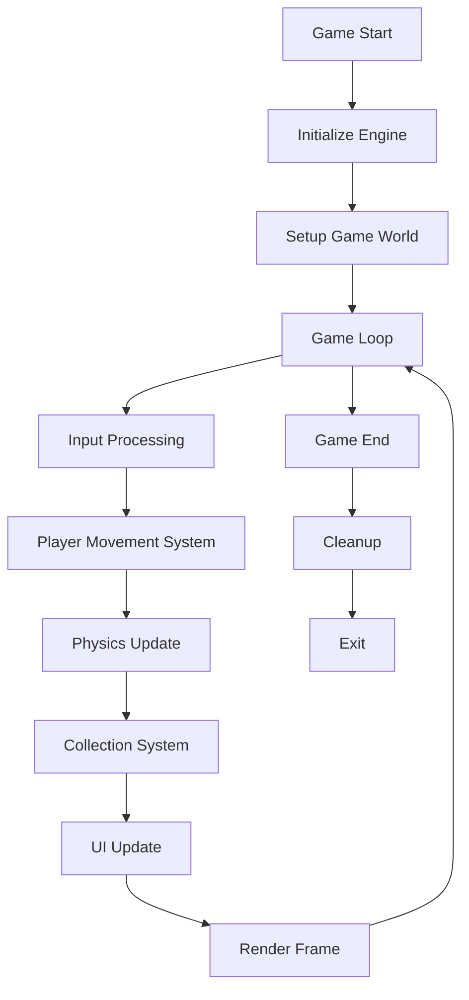

# Your First Game

This tutorial walks you through creating your first game using the engine. We'll build a simple 3D game where you control a cube that can move around and collect items.

## Project Setup

### 1. Create a New Project

```bash
cargo new my_first_game --bin
cd my_first_game
```

### 2. Add Dependencies

Edit `Cargo.toml`:

```toml
[package]
name = "my_first_game"
version = "0.1.0"
edition = "2021"

[dependencies]
game_engine = { path = "/path/to/game_engine/game_engine" }
nalgebra = "0.32"
```

## Basic Game Structure

### Main Entry Point

Create `src/main.rs`:

```rust
use game_engine::prelude::*;

fn main() -> Result<(), Box<dyn std::error::Error>> {
    // Create the engine
    let mut engine = Engine::new()?;

    // Setup our game
    setup_game(&mut engine)?;

    // Run the game loop
    engine.run()?;

    Ok(())
}

fn setup_game(engine: &mut Engine) -> Result<(), Box<dyn std::error::Error>> {
    let world = &mut engine.world;

    // Create player
    let player = create_player(world);
    engine.resources.set("player", player);

    // Create floor
    create_floor(world);

    // Create collectibles
    create_collectibles(world, 10);

    // Create camera
    create_camera(world);

    // Add custom systems
    engine.add_system(PlayerMovementSystem);
    engine.add_system(CollectionSystem);

    Ok(())
}
```

## Creating the Player

```rust
fn create_player(world: &mut World) -> Entity {
    let entity = world.create_entity();

    // Transform component
    world.add_component(entity, Transform {
        position: Vector3::new(0.0, 1.0, 0.0),
        rotation: UnitQuaternion::identity(),
        scale: Vector3::new(1.0, 1.0, 1.0),
    });

    // Mesh component
    world.add_component(entity, Mesh::from_cube());

    // Material component
    world.add_component(entity, Material {
        color: Color::new(0.2, 0.6, 1.0, 1.0),
        ..Default::default()
    });

    // Velocity component
    world.add_component(entity, Velocity {
        x: 0.0,
        y: 0.0,
        z: 0.0,
    });

    // Player tag
    world.add_component(entity, Player);

    entity
}
```

## Creating the Environment

```rust
fn create_floor(world: &mut World) {
    let floor = world.create_entity();

    world.add_component(floor, Transform {
        position: Vector3::new(0.0, 0.0, 0.0),
        rotation: UnitQuaternion::identity(),
        scale: Vector3::new(20.0, 0.1, 20.0),
    });

    world.add_component(floor, Mesh::from_cube());

    world.add_component(floor, Material {
        color: Color::new(0.3, 0.3, 0.3, 1.0),
        ..Default::default()
    });
}

fn create_collectibles(world: &mut World, count: usize) {
    for i in 0..count {
        let angle = (i as f32) / (count as f32) * std::f32::consts::PI * 2.0;
        let radius = 5.0;

        let collectible = world.create_entity();

        world.add_component(collectible, Transform {
            position: Vector3::new(
                angle.cos() * radius,
                1.0,
                angle.sin() * radius,
            ),
            rotation: UnitQuaternion::identity(),
            scale: Vector3::new(0.5, 0.5, 0.5),
        });

        world.add_component(collectible, Mesh::from_cube());

        world.add_component(collectible, Material {
            color: Color::new(1.0, 0.8, 0.2, 1.0),
            ..Default::default()
        });

        world.add_component(collectible, Collectible);
    }
}

fn create_camera(world: &mut World) {
    let camera = world.create_entity();

    world.add_component(camera, Transform {
        position: Vector3::new(0.0, 5.0, 10.0),
        rotation: UnitQuaternion::face_towards(
            &Vector3::new(0.0, 0.0, 0.0),
            &Vector3::new(0.0, 1.0, 0.0),
        ),
        scale: Vector3::new(1.0, 1.0, 1.0),
    });

    world.add_component(camera, Camera::new());
}
```

## Components

```rust
#[derive(Component)]
struct Player;

#[derive(Component)]
struct Collectible;

#[derive(Component, Debug)]
struct Velocity {
    x: f32,
    y: f32,
    z: f32,
}

#[derive(Component, Debug)]
struct Score {
    value: u32,
}
```

## Player Movement System

```rust
struct PlayerMovementSystem;

impl System for PlayerMovementSystem {
    fn update(&mut self, world: &mut World, delta_time: f32) {
        // Query player entity
        for (entity, player, transform, mut velocity) in
            world.query::<(&Player, &Transform, &mut Velocity)>()
        {
            // Get input (accessed through world resources)
            let input = world.get_resource::<Input>().unwrap();

            let speed = 5.0;
            let mut movement = Vector3::new(0.0, 0.0, 0.0);

            if input.is_key_pressed(KeyCode::W) {
                movement.z -= 1.0;
            }
            if input.is_key_pressed(KeyCode::S) {
                movement.z += 1.0;
            }
            if input.is_key_pressed(KeyCode::A) {
                movement.x -= 1.0;
            }
            if input.is_key_pressed(KeyCode::D) {
                movement.x += 1.0;
            }

            // Normalize diagonal movement
            if movement.norm() > 0.0 {
                movement = movement.normalize() * speed;
            }

            // Update velocity
            velocity.x = movement.x;
            velocity.y = movement.y;
            velocity.z = movement.z;
        }

        // Apply velocity to position
        for (entity, (transform, velocity)) in world.query::<(&mut Transform, &Velocity)>() {
            transform.position.x += velocity.x * delta_time;
            transform.position.y += velocity.y * delta_time;
            transform.position.z += velocity.z * delta_time;
        }
    }
}
```

## Collection System

```rust
struct CollectionSystem;

impl System for CollectionSystem {
    fn update(&mut self, world: &mut World, delta_time: f32) {
        // Find player position
        let mut player_position = None;

        for (entity, player, transform) in world.query::<(&Player, &Transform)>() {
            player_position = Some(transform.position);
        }

        if let Some(player_pos) = player_position {
            // Check for collisions with collectibles
            let mut to_despawn = Vec::new();

            for (entity, collectible, transform) in world.query::<(&Collectible, &Transform)>() {
                let distance = (transform.position - player_pos).norm();

                if distance < 1.0 {
                    to_despawn.push(entity);
                }
            }

            // Despawn collected items
            for entity in to_despawn {
                world.despawn(entity);
                println!("Collected an item!");
            }
        }
    }
}
```

## Adding Score

```rust
fn setup_game(engine: &mut Engine) -> Result<(), Box<dyn std::error::Error>> {
    // ... previous code ...

    // Add score component
    let score_entity = world.create_entity();
    world.add_component(score_entity, Score { value: 0 });

    // Store as resource for easy access
    engine.resources.set("score", score_entity);

    Ok(())
}
```

Update the collection system:

```rust
impl System for CollectionSystem {
    fn update(&mut self, world: &mut World, delta_time: f32) {
        // Get score entity
        let score_entity = world.get_resource::<Entity>("score").unwrap();

        // ... find player and check collisions ...

        // Despawn and update score
        for entity in to_despawn {
            world.despawn(entity);

            if let Some(mut score) = world.get_component_mut::<Score>(score_entity) {
                score.value += 10;
                println!("Score: {}", score.value);
            }
        }
    }
}
```

## Adding Physics

Enable physics for more realistic interactions:

```rust
fn create_player(world: &mut World) -> Entity {
    let entity = world.create_entity();

    // ... add transform, mesh, material ...

    // Add physics components
    world.add_component(entity, RigidBody::dynamic());
    world.add_component(entity, Collider::cuboid(1.0, 1.0, 1.0));

    entity
}

fn create_floor(world: &mut World) {
    let floor = world.create_entity();

    // ... add transform, mesh, material ...

    // Static physics body
    world.add_component(floor, RigidBody::static());
    world.add_component(floor, Collider::cuboid(20.0, 0.1, 20.0));
}
```

## Adding Sound

```rust
fn setup_game(engine: &mut Engine) -> Result<(), Box<dyn std::error::Error>> {
    // ... previous code ...

    // Load sounds
    engine.resources.load::<Sound>("collect.wav")?;
    engine.resources.load::<Sound>("background.mp3")?;

    // Play background music
    engine.audio.play_music("background.mp3", true)?;

    Ok(())
}
```

Update the collection system:

```rust
impl System for CollectionSystem {
    fn update(&mut self, world: &mut World, delta_time: f32) {
        // Get audio from resources
        let audio = world.get_resource::<Audio>().unwrap();

        // ... collision detection ...

        for entity in to_despawn {
            world.despawn(entity);

            // Play collection sound
            audio.play_sound("collect.wav").unwrap();
        }
    }
}
```

## Adding UI

```rust
fn setup_game(engine: &mut Engine) -> Result<(), Box<dyn std::error::Error>> {
    // ... previous code ...

    // Create UI system
    engine.add_system(UISystem);

    Ok(())
}

struct UISystem;

impl System for UISystem {
    fn update(&mut self, world: &mut World, delta_time: f32) {
        // Get score
        let score_entity = world.get_resource::<Entity>("score").unwrap();
        let score = world.get_component::<Score>(score_entity).unwrap();

        // Update UI (implementation depends on UI system)
        // ui.update_text(format!("Score: {}", score.value));
    }
}
```

## Complete Game Loop

The complete game loop structure:



## Running the Game

```bash
# Run in debug mode (faster compilation)
cargo run

# Run in release mode (better performance)
cargo run --release
```

## Next Steps

Now that you have a basic game, try extending it:

- Add obstacles to avoid
- Add enemies that chase the player
- Add a timer to collect items quickly
- Add different types of collectibles
- Add particle effects when collecting items
- Save high scores to disk
- Add multiple levels

## Resources

- [Engine API](./api/engine.md) - Core engine functionality
- [ECS API](./api/ecs.md) - Entity Component System
- [Rendering API](./api/rendering.md) - Rendering components
- [Physics API](./api/physics.md) - Physics simulation
- [Audio API](./api/audio.md) - Sound and music
- [Examples](../examples.md) - More example code

Happy game development!
