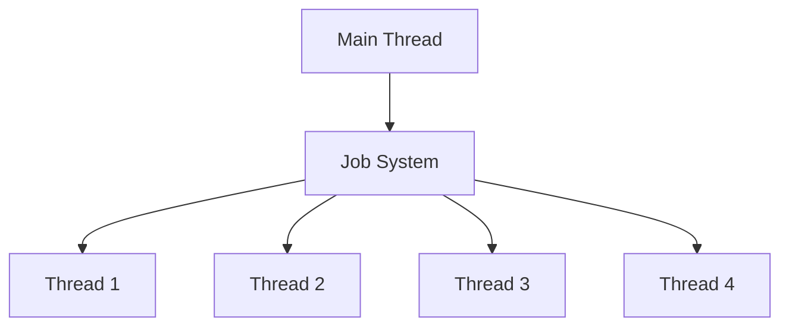

# Multi-threading

This document describes the multi-threading architecture.

## Overview

The engine uses multi-threading for parallel processing of game logic.

## Thread Architecture

## Thread Safety

- ECS: Thread-safe queries
- Resources: Atomic reference counting
- Rendering: Command buffers

## See Also

- [ADR-004: Concurrency Model](./adr/0004-concurrency-model.md)
- [Performance Optimization](./performance_tuning_guide.md)
