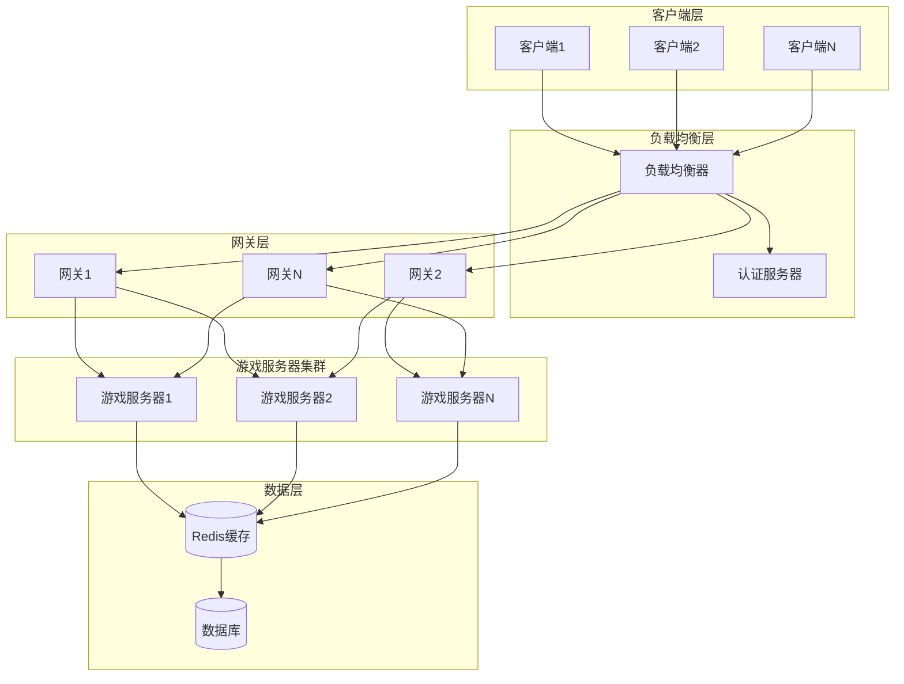
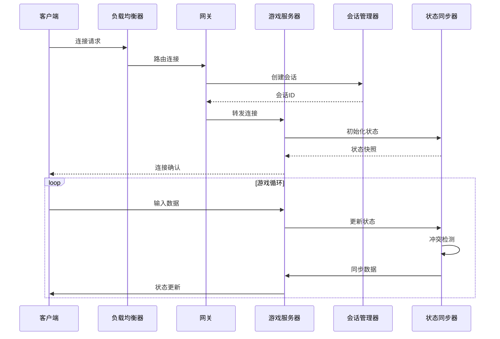

# 多客户端网络架构设计文档

## 1. 架构概述

### 1.1 设计目标

基于现有游戏引擎网络模块，设计一个支持100+并发客户端的高性能网络架构，满足以下要求：

- **并发性能**: 支持100+并发客户端连接
- **低延迟**: 端到端延迟<50ms
- **高可用性**: 具备连接池和会话管理功能
- **可扩展性**: 支持负载均衡和故障转移
- **兼容性**: 与现有网络预测和补偿模块兼容

### 1.2 架构原则

1. **分层设计**: 清晰的层次结构，便于维护和扩展
2. **模块化**: 各功能模块独立，降低耦合度
3. **异步处理**: 非阻塞I/O，提升并发性能
4. **状态分离**: 客户端状态与服务器状态分离管理
5. **智能路由**: 基于负载和延迟的智能路由策略

### 1.3 整体架构



## 2. 模块划分与交互

### 2.1 核心模块

#### 2.1.1 连接管理模块 (ConnectionManager)

**职责**:
- 管理客户端连接生命周期
- 维护连接池和会话状态
- 处理连接认证和授权

**核心组件**:
```rust
pub struct ConnectionManager {
    // 连接池
    connection_pool: Arc<RwLock<ConnectionPool>>,
    // 会话管理器
    session_manager: Arc<RwLock<SessionManager>>,
    // 认证服务
    auth_service: Arc<AuthService>,
    // 配置
    config: ConnectionConfig,
}
```

#### 2.1.2 负载均衡模块 (LoadBalancer)

**职责**:
- 智能路由客户端连接
- 监控服务器负载状态
- 动态调整路由策略

**负载均衡策略**:
1. **最少连接数**: 分配到连接数最少的服务器
2. **加权轮询**: 基于服务器性能加权分配
3. **延迟优先**: 优先分配到延迟最低的服务器
4. **地理位置**: 基于客户端地理位置就近分配

#### 2.1.3 会话管理模块 (SessionManager)

**职责**:
- 维护客户端会话状态
- 处理会话持久化和恢复
- 管理会话超时和清理

**会话数据结构**:
```rust
pub struct Session {
    pub session_id: Uuid,
    pub client_id: u64,
    pub user_id: Option<u64>,
    pub server_id: u32,
    pub created_at: SystemTime,
    pub last_activity: SystemTime,
    pub metadata: HashMap<String, String>,
}
```

#### 2.1.4 状态同步模块 (StateSyncManager)

**职责**:
- 管理游戏状态同步
- 处理冲突检测和解决
- 优化同步频率和数据量

**同步策略**:
1. **增量同步**: 只同步变化的状态数据
2. **优先级同步**: 重要状态优先同步
3. **区域同步**: 只同步感兴趣区域的状态
4. **压缩传输**: 使用压缩算法减少带宽

### 2.2 模块交互流程



## 3. 关键技术选型

### 3.1 网络协议

#### 3.1.1 TCP + UDP混合协议

**TCP用于**:
- 连接建立和认证
- 可靠数据传输（如聊天、道具交易）
- 状态同步确认

**UDP用于**:
- 实时位置更新
- 快速输入传输
- 低延迟要求的数据

#### 3.1.2 WebSocket支持

- 支持Web客户端连接
- 自动处理NAT穿透
- 降低浏览器兼容性复杂度

### 3.2 序列化技术

#### 3.2.1 增量序列化优化

基于现有的[`delta_serialization`](src/network/delta_serialization.rs:1)模块，进一步优化：

1. **智能差异检测**: 只检测真正变化的数据
2. **压缩算法优化**: 使用更高效的压缩算法
3. **批量处理**: 批量处理多个实体的变化

#### 3.2.2 协议缓冲区(Protocol Buffers)

- 高效的二进制序列化
- 跨语言支持
- 向后兼容性

### 3.3 缓存策略

#### 3.3.1 Redis集群

**用途**:
- 会话状态缓存
- 实时游戏状态缓存
- 服务器间状态同步

**数据结构**:
```redis
# 会话缓存
session:{session_id} -> {session_data}

# 服务器状态
server:{server_id} -> {load, status, player_count}

# 游戏状态
game_state:{room_id} -> {entity_states}
```

#### 3.3.2 本地缓存

- LRU缓存热点数据
- 减少Redis访问压力
- 提升响应速度

### 3.4 数据库选择

#### 3.4.1 时序数据库 (InfluxDB)

**用途**:
- 游戏事件记录
- 性能指标存储
- 玩家行为分析

#### 3.4.2 关系型数据库 (PostgreSQL)

**用途**:
- 用户账户管理
- 游戏配置存储
- 持久化游戏数据

## 4. 实现步骤

### 4.1 第一阶段：基础架构 (2-3周)

**目标**: 建立基础的多客户端支持架构

**任务**:
1. **连接管理器重构**
   - 基于现有[`client.rs`](src/network/client.rs:1)扩展
   - 实现连接池管理
   - 添加会话管理功能

2. **负载均衡器实现**
   - 实现基本负载均衡算法
   - 添加服务器健康检查
   - 集成认证服务

3. **状态同步优化**
   - 基于现有[`synchronization.rs`](src/network/synchronization.rs:1)优化
   - 实现增量同步算法
   - 添加冲突解决机制

**交付物**:
- 支持基础多客户端连接的服务器
- 简单的负载均衡功能
- 优化的状态同步机制

### 4.2 第二阶段：性能优化 (2-3周)

**目标**: 优化性能，支持100+并发客户端

**任务**:
1. **异步I/O优化**
   - 使用Tokio异步运行时
   - 实现非阻塞网络处理
   - 优化内存使用

2. **缓存层实现**
   - 集成Redis缓存
   - 实现本地缓存策略
   - 优化数据访问模式

3. **网络协议优化**
   - 实现TCP/UDP混合协议
   - 添加WebSocket支持
   - 优化序列化性能

**交付物**:
- 高性能异步网络服务器
- 完整的缓存解决方案
- 优化的网络协议栈

### 4.3 第三阶段：高可用性 (2-3周)

**目标**: 实现高可用性和故障转移

**任务**:
1. **故障检测机制**
   - 实现服务器健康监控
   - 添加自动故障检测
   - 实现故障通知机制

2. **故障转移策略**
   - 实现自动故障转移
   - 添加数据同步机制
   - 优化恢复时间

3. **监控和日志**
   - 实现性能监控
   - 添加详细日志记录
   - 集成告警系统

**交付物**:
- 高可用性服务器集群
- 完整的故障转移机制
- 全面的监控解决方案

### 4.4 第四阶段：性能调优 (1-2周)

**目标**: 最终性能调优和测试

**任务**:
1. **压力测试**
   - 100+并发客户端测试
   - 性能瓶颈分析
   - 内存和CPU优化

2. **延迟优化**
   - 网络延迟优化
   - 算法性能优化
   - 缓存策略调优

3. **兼容性测试**
   - 与现有预测模块集成测试
   - 延迟补偿模块兼容性测试
   - 端到端功能测试

**交付物**:
- 完整的性能测试报告
- 优化的生产环境配置
- 兼容性验证报告

## 5. 性能优化策略

### 5.1 网络层优化

#### 5.1.1 连接池优化

**策略**:
- 预分配连接池，避免频繁创建销毁
- 使用连接复用，减少连接开销
- 实现连接健康检查，及时清理无效连接

**实现**:
```rust
pub struct ConnectionPool {
    // 空闲连接队列
    idle_connections: VecDeque<TcpStream>,
    // 活跃连接映射
    active_connections: HashMap<u64, TcpStream>,
    // 连接配置
    config: PoolConfig,
    // 统计信息
    stats: PoolStats,
}
```

#### 5.1.2 数据包优化

**策略**:
- 数据包合并，减少网络往返次数
- 优先级队列，重要数据优先传输
- 自适应压缩，根据网络状况调整压缩级别

### 5.2 应用层优化

#### 5.2.1 兴趣管理 (Interest Management)

**原理**: 只向客户端发送其感兴趣区域内的实体状态

**实现**:
```rust
pub struct InterestManager {
    // 空间索引
    spatial_index: QuadTree<Entity>,
    // 客户端兴趣区域
    client_interests: HashMap<u64, InterestArea>,
}

pub struct InterestArea {
    pub center: Vec3,
    pub radius: f32,
    pub layers: Vec<LayerType>,
}
```

#### 5.2.2 状态优先级

**优先级分类**:
1. **高优先级**: 玩家位置、生命值、关键动作
2. **中优先级**: 非玩家实体位置、环境变化
3. **低优先级**: 装饰性元素、音效状态

### 5.3 系统级优化

#### 5.3.1 内存管理

**策略**:
- 对象池模式，减少内存分配
- 内存预分配，避免运行时分配
- 定期垃圾回收，释放无用内存

#### 5.3.2 CPU优化

**策略**:
- 多核并行处理，充分利用CPU资源
- SIMD指令优化，加速数值计算
- 缓存友好的数据结构，提高缓存命中率

## 6. 测试计划

### 6.1 单元测试

**测试范围**:
- 连接管理器功能测试
- 负载均衡算法测试
- 会话管理功能测试
- 状态同步逻辑测试

**测试目标**:
- 代码覆盖率 > 90%
- 所有核心功能正常工作
- 边界条件处理正确

### 6.2 集成测试

**测试场景**:
1. **多客户端连接测试**
   - 模拟100+客户端同时连接
   - 验证连接建立和断开流程
   - 测试连接池管理功能

2. **负载均衡测试**
   - 测试不同负载均衡算法
   - 验证故障转移机制
   - 测试动态负载调整

3. **状态同步测试**
   - 测试状态同步准确性
   - 验证冲突解决机制
   - 测试增量同步效率

### 6.3 性能测试

**测试指标**:
- **并发连接数**: 目标100+并发客户端
- **响应延迟**: 目标<50ms端到端延迟
- **吞吐量**: 目标1000+消息/秒
- **资源使用**: CPU使用率<80%，内存使用<4GB

**测试工具**:
- 自定义压力测试工具
- 网络延迟模拟器
- 性能监控工具

### 6.4 压力测试

**测试场景**:
1. **峰值负载测试**
   - 突发150+客户端连接
   - 持续高负载运行30分钟
   - 监控系统稳定性

2. **长时间运行测试**
   - 100客户端连接运行24小时
   - 监控内存泄漏
   - 验证性能稳定性

3. **网络异常测试**
   - 模拟网络延迟和丢包
   - 测试断线重连机制
   - 验证故障恢复能力

## 7. 与现有模块的兼容性

### 7.1 预测模块兼容性

**现有模块**: [`prediction.rs`](src/network/prediction.rs:1)

**兼容性策略**:
1. **接口保持**: 保持现有预测模块的接口不变
2. **数据格式兼容**: 确保预测数据格式与新架构兼容
3. **性能优化**: 在不改变功能的前提下优化性能

**集成方案**:
```rust
// 扩展现有的ClientPredictionManager
pub struct EnhancedClientPredictionManager {
    // 原有预测管理器
    base_prediction: ClientPredictionManager,
    // 新增多客户端支持
    multi_client_support: MultiClientSupport,
    // 连接池集成
    connection_pool: Arc<ConnectionPool>,
}
```

### 7.2 延迟补偿模块兼容性

**现有模块**: [`delay_compensation.rs`](src/network/delay_compensation.rs:1)

**兼容性策略**:
1. **算法保持**: 保持现有延迟补偿算法不变
2. **数据扩展**: 扩展延迟测量数据以支持多客户端
3. **性能优化**: 优化延迟补偿计算性能

**集成方案**:
```rust
// 扩展现有的ClientDelayCompensation
pub struct MultiClientDelayCompensation {
    // 每个客户端的延迟补偿
    client_compensations: HashMap<u64, ClientDelayCompensation>,
    // 全局延迟统计
    global_stats: GlobalLatencyStats,
}
```

### 7.3 同步模块兼容性

**现有模块**: [`synchronization.rs`](src/network/synchronization.rs:1)

**兼容性策略**:
1. **策略扩展**: 扩展现有同步策略以支持多客户端
2. **冲突解决**: 增强冲突解决机制
3. **性能优化**: 优化同步算法性能

## 8. 部署和运维

### 8.1 部署架构

**容器化部署**:
- 使用Docker容器化各个服务
- Kubernetes编排管理
- 自动扩缩容支持

**监控体系**:
- Prometheus + Grafana监控
- ELK日志收集分析
- 自定义业务指标监控

### 8.2 运维策略

**自动化运维**:
- 自动化部署流程
- 自动故障检测和恢复
- 自动性能调优

**容量规划**:
- 基于历史数据的容量预测
- 动态资源调整
- 成本优化策略

## 9. 总结

本架构设计基于现有游戏引擎网络模块，通过分层设计、模块化架构和性能优化，实现了支持100+并发客户端的高性能网络架构。主要特点包括：

1. **高性能**: 通过异步I/O、连接池和缓存优化实现高性能
2. **高可用**: 通过负载均衡和故障转移确保高可用性
3. **可扩展**: 模块化设计便于功能扩展和性能调优
4. **兼容性**: 与现有预测和补偿模块完全兼容
5. **易维护**: 清晰的架构设计和完善的监控体系

通过分阶段的实现计划和全面的测试策略，确保架构的可靠性和稳定性。该架构能够满足现代多人游戏的网络需求，为游戏引擎的网络模块提供强大的技术支撑。