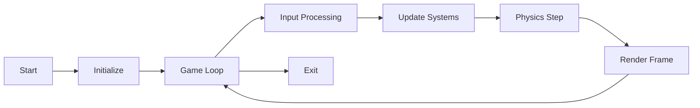

# Quick Start

Welcome to the Game Engine! This guide will get you up and running in 5 minutes.

## Prerequisites

Before you begin, ensure you have the following installed:

- **Rust 1.70 or later** - [Install from rustup.rs](https://rustup.rs/)
- **Git** - For cloning the repository
- **A code editor** - VS Code with rust-analyzer is recommended

## Installation

### 1. Clone the Repository

```bash
git clone https://github.com/yourusername/game_engine.git
cd game_engine
```

### 2. Build the Engine

```bash
# Build in release mode for best performance
cargo build --release

# Or build in debug mode for development
cargo build
```

### 3. Run Examples

The engine includes several examples to help you get started:

```bash
# Hello World - The simplest example
cargo run --example hello_world

# ECS Basics - Learn the Entity Component System
cargo run --example ecs_basics

# Rendering - Basic rendering demo
cargo run --example rendering

# Physics - Physics simulation
cargo run --example physics

# Audio - Sound playback
cargo run --example audio
```

## Your First Project

Create a new Rust project:

```bash
cargo new my_game --bin
cd my_game
```

Add the game engine to your `Cargo.toml`:

```toml
[dependencies]
game_engine = { path = "/path/to/game_engine/game_engine" }
```

### Creating a Simple Game

Replace the contents of `src/main.rs` with:

```rust
use game_engine::prelude::*;

fn main() -> Result<(), Box<dyn std::error::Error>> {
    // Create the engine with default configuration
    let mut engine = Engine::new();

    // Get the ECS world
    let world = &mut engine.world;

    // Create a simple entity with a cube mesh
    let entity = world.create_entity();
    world.add_component(entity, Transform::default());
    world.add_component(entity, Mesh::from_cube());
    world.add_component(entity, Material::default());

    // Add a camera
    let camera = world.create_entity();
    world.add_component(camera, Transform::position(0.0, 2.0, 5.0));
    world.add_component(camera, Camera::new());

    // Run the game loop
    engine.run()
}
```

Run your game:

```bash
cargo run
```

## Understanding the Basics

### ECS (Entity Component System)

The engine uses an ECS architecture:

- **Entities**: Unique IDs representing game objects
- **Components**: Data attached to entities (position, mesh, etc.)
- **Systems**: Logic that operates on components

```rust
// Create an entity
let player = world.create_entity();

// Add components
world.add_component(player, Transform::position(0.0, 0.0, 0.0));
world.add_component(player, Velocity::new(1.0, 0.0, 0.0));
world.add_component(player, Mesh::from_cube());

// Query entities with specific components
for (entity, transform, velocity) in world.query::<(&Transform, &Velocity)>() {
    // Update positions based on velocity
}
```

### The Game Loop

The engine handles the game loop automatically:



Each frame, the engine:
1. Processes input events
2. Updates all game systems
3. Simulates physics
4. Renders the scene

### Resources

Load and manage game resources:

```rust
// Load a texture
let texture = engine.resources.load::<Texture>("player.png")?;

// Load a 3D model
let model = engine.resources.load::<Model>("player.gltf")?;

// Load audio
let sound = engine.resources.load::<Sound>("jump.wav")?;
```

## Next Steps

Now that you have a basic understanding, explore more advanced features:

- [Architecture Overview](./architecture/overview.md) - Learn about the engine design
- [API Reference](./api_reference.md) - Detailed API documentation
- [Examples](./examples.md) - More example code
- [Performance Optimization](./performance_tuning_guide.md) - Optimize your game
- [Best Practices](./best_practices.md) - Recommended patterns

## Common Tasks

### Adding Physics

```rust
// Add physics component
world.add_component(entity, RigidBody::dynamic());
world.add_component(entity, Collider::cuboid(1.0, 1.0, 1.0));
```

### Playing Audio

```rust
// Play background music
engine.audio.play_music("background.mp3", true)?;

// Play sound effect
engine.audio.play_sound("explosion.wav")?;
```

### Handling Input

```rust
// In your system
if engine.input.is_key_pressed(KeyCode::W) {
    // Move forward
}

if engine.input.is_mouse_button_pressed(MouseButton::Left) {
    // Shoot
}
```

## Getting Help

If you encounter issues:

- [Troubleshooting](./troubleshooting.md) - Common problems and solutions
- [FAQ](./faq.md) - Frequently asked questions
- [Community] - Join our community (link to be added)

## What's Next?

Explore the full capabilities of the engine:

- [Domain-Driven Design](./domain_overview.md) - Architectural patterns
- [CQRS Pattern](./guides/cqrs_guide.md) - Command Query Separation
- [Event Sourcing](./guides/event_sourcing_guide.md) - Event-driven architecture
- [Rendering Pipeline](./rendering_pipeline.md) - Advanced rendering
- [Networking](./networking_system.md) - Multiplayer games

Happy game development!
