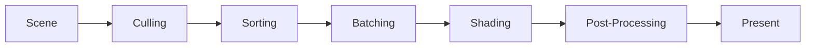

# Rendering Pipeline

This document describes the rendering pipeline architecture and implementation.

## Overview

The rendering pipeline transforms scene data into rendered frames.

## Pipeline Stages

## Key Components

- **Scene Graph** - Hierarchical organization of objects
- **Renderer** - Executes rendering commands
- **GPU Backend** - Abstracted graphics API layer

## See Also

- [ADR-003: Rendering Pipeline](./adr/0003-rendering-pipeline.md)
- [Architecture Overview](./architecture.md)
