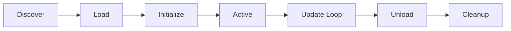

# Plugin System Guide

Complete guide for the Game Engine Editor plugin system.

## Table of Contents

1. [Introduction](#introduction)
2. [Architecture](#architecture)
3. [Plugin Lifecycle](#plugin-lifecycle)
4. [Creating Plugins](#creating-plugins)
5. [Plugin API Reference](#plugin-api-reference)
6. [Sandbox and Security](#sandbox-and-security)
7. [Event System](#event-system)
8. [Configuration](#configuration)
9. [Testing Plugins](#testing-plugins)
10. [Distribution](#distribution)

## Introduction

The plugin system allows developers to extend the game engine editor with custom functionality. Plugins are dynamically loadable modules that can:

- Add new tools and commands
- Modify editor behavior
- Integrate with external systems
- Create custom UI components
- Process assets and scenes
- Respond to editor events

### Key Features

- **Type Safety**: Full Rust type system support
- **Hot Reload**: Update plugins without restarting the editor
- **Sandboxing**: Secure plugin execution with permission controls
- **Multi-Language**: Support for Rust, WASM, TypeScript, and Lua
- **Event System**: Pub/sub communication between plugins and engine
- **Dependency Management**: Automatic dependency resolution
- **Version Compatibility**: API version checking

## Architecture

```
┌─────────────────────────────────────────────────────────┐
│                     Plugin Manager                       │
│  - Lifecycle management                                 │
│  - Dependency resolution                                │
│  - Hot reload coordination                              │
└────────────┬────────────────────────────────────────────┘
             │
    ┌────────┴────────┬────────────┬────────────┐
    │                 │            │            │
┌───▼────┐  ┌────────▼───┐  ┌────▼────┐  ┌────▼────┐
│Loader  │  │  Registry  │  │ EventBus│  │Sandbox │
└────────┘  └────────────┘  └─────────┘  └─────────┘
    │                 │            │            │
    │                 │            │            │
┌───▼────┐      ┌────▼────┐  ┌────▼────┐  ┌────▼────┐
│Plugins │      │Metadata │  │Events  │  │Security│
└────────┘      └─────────┘  └─────────┘  └─────────┘
```

### Core Components

1. **Plugin Manager**: Orchestrates all plugin operations
2. **Plugin Loader**: Handles dynamic loading of plugin files
3. **Plugin Registry**: Manages plugin metadata and discovery
4. **Event Bus**: Facilitates communication between components
5. **Sandbox**: Enforces security and resource limits

## Plugin Lifecycle



### Lifecycle Stages

1. **Discovery**: Scan plugin directories for valid plugins
2. **Loading**: Load plugin binary/module into memory
3. **Initialization**: Call `on_load()` with plugin context
4. **Active**: Plugin receives updates and events
5. **Update**: Call `on_update()` each frame
6. **Unload**: Call `on_unload()` for cleanup
7. **Cleanup**: Release resources and remove from memory

## Creating Plugins

### Rust Plugin (Native)

Create a new Rust project:

```bash
cargo new --lib my_plugin
cd my_plugin
```

Update `Cargo.toml`:

```toml
[package]
name = "my_plugin"
version = "0.1.0"
edition = "2021"

[lib]
crate-type = ["cdylib"]

[dependencies]
game-engine-editor = "0.1"
```

Implement the plugin:

```rust
use game_engine_editor::plugin::api::{Plugin, PluginContext};
use game_engine_editor::plugin::export_plugin;

#[derive(Default)]
pub struct MyPlugin;

impl Plugin for MyPlugin {
    fn name(&self) -> &str {
        "my_plugin"
    }

    fn version(&self) -> &str {
        "0.1.0"
    }

    fn on_load(&mut self, _context: PluginContext) -> game_engine_editor::plugin::Result<()> {
        println!("Plugin loaded!");
        Ok(())
    }

    fn on_update(&mut self, _context: PluginContext, delta_time: f32) {
        // Update logic
    }
}

export_plugin!(MyPlugin);
```

Build:

```bash
cargo build --release
```

### WASM Plugin

Create a Rust project configured for WASM:

```toml
[lib]
crate-type = ["cdylib"]

[dependencies]
wasm-bindgen = "0.2"
```

Implement WASM-compatible plugin:

```rust
use wasm_bindgen::prelude::*;

#[wasm_bindgen]
pub fn name() -> String {
    "my_wasm_plugin".to_string()
}

#[wasm_bindgen]
pub fn version() -> String {
    "0.1.0".to_string()
}

#[wasm_bindgen]
pub fn on_load() -> i32 {
    0 // Success
}
```

Build:

```bash
cargo build --release --target wasm32-unknown-unknown
wasm-bindgen target/wasm32-unknown-unknown/release/my_plugin.wasm
```

### TypeScript Plugin

Create `plugin.ts`:

```typescript
const plugin = {
    name: "my-plugin",
    version: "0.1.0",

    async onLoad(context) {
        console.log("Plugin loaded!");
    },

    onUpdate(context, deltaTime) {
        // Update logic
    }
};

registerPlugin(plugin);
```

Compile with `tsc` and load into editor.

### Lua Plugin

Create `plugin.lua`:

```lua
local plugin = {
    name = "my_lua_plugin",
    version = "0.1.0"
}

function plugin:on_load(context)
    print("Plugin loaded!")
end

function plugin:on_update(context, delta_time)
    -- Update logic
end

return plugin
```

## Plugin API Reference

### Plugin Trait

```rust
pub trait Plugin: Any {
    // Metadata
    fn name(&self) -> &str;
    fn version(&self) -> &str;
    fn api_version(&self) -> &str;
    fn description(&self) -> &str;
    fn author(&self) -> &str;

    // Dependencies
    fn dependencies(&self) -> &[&str];
    fn capabilities(&self) -> &[PluginCapability];

    // Lifecycle
    fn on_load(&mut self, context: PluginContext) -> Result<()>;
    fn on_unload(&mut self, context: PluginContext) -> Result<()>;
    fn on_update(&mut self, context: PluginContext, delta_time: f32);
    fn on_event(&mut self, event: &PluginEvent);

    // Configuration
    fn config(&self) -> Option<PluginConfig>;
}
```

### Plugin Context

```rust
pub struct PluginContext {
    pub engine_api: EngineApi,
    pub resource_manager: ResourceManager,
    pub config: PluginConfig,
    pub data: HashMap<String, String>,
}
```

### Plugin Capabilities

```rust
pub enum PluginCapability {
    Render,
    Audio,
    Physics,
    Network,
    FileSystem,
    UserInterface,
    SceneModification,
    AssetPipeline,
    Custom(String),
}
```

### Plugin Events

```rust
pub enum PluginEvent {
    PluginLoaded { name: String },
    PluginUnloaded { name: String },
    PluginError { name: String, error: String },
    SceneLoaded { path: String },
    SceneSaved { path: String },
    AssetImported { path: String },
    Tick { delta_time: f32 },
    Custom { type_: String, data: serde_json::Value },
}
```

## Sandbox and Security

### Permissions

Plugins operate in a sandbox with controlled permissions:

```rust
pub enum PluginPermission {
    Read,
    Write,
    Network,
    Filesystem,
    Custom(String),
}
```

### Resource Limits

Configure resource limits:

```rust
pub struct ResourceLimits {
    pub max_memory_mb: usize,
    pub max_cpu_time_ms: u64,
    pub max_file_handles: usize,
    pub max_network_connections: usize,
}
```

### Path Access Control

Restrict file system access:

```rust
let mut sandbox = Sandbox::new(permissions);
sandbox.allow_path(PathBuf::from("/tmp/allowed"));
sandbox.allow_host("api.example.com".to_string());
```

## Event System

### Subscribing to Events

```rust
// In plugin
fn on_load(&mut self, context: PluginContext) -> Result<()> {
    let event_bus = context.engine_api.event_bus();
    let mut subscriber = event_bus.subscribe();

    // In a separate task
    tokio::spawn(async move {
        while let Ok(event) = subscriber.recv().await {
            handle_event(event);
        }
    });

    Ok(())
}
```

### Publishing Events

```rust
event_bus.publish(PluginEvent::Custom {
    type_: "my_custom_event".to_string(),
    data: serde_json::json!({"key": "value"}),
}).await;
```

## Configuration

### Plugin Config File

Create `plugin.toml`:

```toml
[metadata]
name = "my_plugin"
version = "0.1.0"
description = "My awesome plugin"
author = "Your Name"

[metadata.capabilities]
render = true
audio = false

[config]
enabled = true
auto_load = true
hot_reload = true

[config.settings]
custom_setting = "value"
```

### Runtime Configuration

Access configuration in plugin:

```rust
fn on_load(&mut self, context: PluginContext) -> Result<()> {
    if let Ok(value) = context.config.get::<String>("custom_setting") {
        println!("Custom setting: {}", value);
    }
    Ok(())
}
```

## Testing Plugins

### Unit Tests

```rust
#[cfg(test)]
mod tests {
    use super::*;

    #[test]
    fn test_plugin_metadata() {
        let plugin = MyPlugin;
        assert_eq!(plugin.name(), "my_plugin");
        assert_eq!(plugin.version(), "0.1.0");
    }

    #[test]
    fn test_plugin_load() {
        let mut plugin = MyPlugin;
        let context = PluginContext::new(
            EngineApi::new(),
            ResourceManager::new(),
            PluginConfig::default(),
        );

        assert!(plugin.on_load(context).is_ok());
    }
}
```

### Integration Tests

Test plugin loading:

```rust
#[tokio::test]
async fn test_plugin_loading() {
    let manager = PluginManager::new();
    manager.add_plugin_dir(PathBuf::from("./plugins"));

    manager.discover_plugins().await.unwrap();
    manager.load_plugin("my_plugin").await.unwrap();

    assert!(manager.is_loaded("my_plugin").await);
}
```

## Distribution

### Plugin Package Structure

```
my_plugin/
├── Cargo.toml
├── Cargo.lock
├── src/
│   └── lib.rs
├── README.md
├── LICENSE
├── plugin.toml          # Plugin manifest
└── target/
    └── release/
        └── libmy_plugin.so  # Compiled plugin
```

### Publishing

1. Update version in `Cargo.toml`
2. Build release binary
3. Create plugin manifest
4. Package everything
5. Distribute via:

   - GitHub Releases
   - Plugin registry
   - Direct download

### Installation

Users install plugins by:

1. Downloading plugin package
2. Extracting to plugin directory
3. Editor automatically discovers and loads

## Best Practices

1. **Error Handling**: Always return proper `Result` types
2. **Resource Management**: Clean up in `on_unload()`
3. **Performance**: Keep `on_update()` lightweight
4. **Compatibility**: Specify minimum API version
5. **Documentation**: Document all public APIs
6. **Testing**: Write comprehensive tests
7. **Versioning**: Follow semantic versioning
8. **Security**: Request minimal permissions

## Troubleshooting

### Plugin Not Loading

- Check plugin path is correct
- Verify dependencies are satisfied
- Check API version compatibility
- Review error messages in editor console

### Hot Reload Not Working

- Ensure `hot_reload: true` in config
- Check file permissions
- Verify plugin manifest is valid

### Performance Issues

- Profile `on_update()` method
- Reduce allocations in hot path
- Use caching where appropriate
- Consider worker threads for heavy tasks

## Additional Resources

- [Plugin SDK Reference](./PLUGIN_SDK_REFERENCE.md)
- [Example Plugins](../examples/)
- [API Documentation](./api_reference.md)
- [Community Plugins](https://github.com/game-engine/plugins)

## Support

- GitHub Issues: https://github.com/game-engine/editor/issues
- Discord: https://discord.gg/game-engine
- Email: support@game-engine.dev
