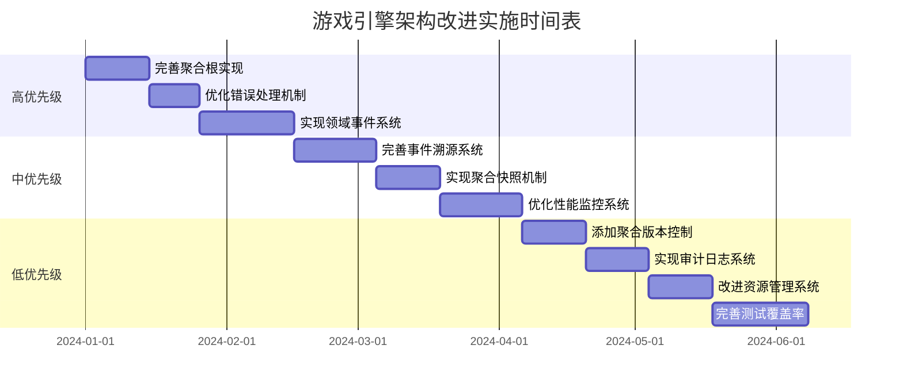

# 游戏引擎实施计划（基于审查报告的落地版）

> 本计划以“通用高性能 Rust 游戏引擎（不内置业务逻辑）”为目标，整合当前仓库中已有的 DDD / 事件系统文档结论，并补齐审查中暴露的工程化阻塞项（workspace 构建基线、测试失败、安全与 unsafe 风险、async 边界混乱、基准与剖析缺口等）。

## 文档信息

- 版本：2.0
- 创建/更新日期：2025-12-17
- 适用范围：本仓库 workspace + game_engine 主 crate + 相关子 crate（game_engine_simd / game_engine_hardware / game_engine_performance）

## 输入与证据来源（必须全部覆盖）

本实施计划覆盖以下已存在文档/结论（不替代其细节，但将其转化为可执行任务与验收标准）：

1. 执行摘要：executive_summary.md
2. 既有 DDD 改进计划与 TODO：implementation_plan.md（本文件旧版内容）与 detailed_todo_list.md
3. 领域事件系统：domain_events_system_design.md 与 event_system_implementation_plan.md
4. 事件溯源：event_sourcing_architecture.md、event_sourcing_improvement_plan.md、event_sourcing_implementation_summary.md
5. 进度/状态摘要：current_progress_summary.md（其中“已完成/待完成”需要与代码现实核对）
6. 审查中发现的工程阻塞与风险（来自代码与构建结果）：
   - workspace 未包含 game_engine crate；导致无法统一测试/基准与依赖继承不一致
   - game_engine manifest 使用 tracing.workspace=true，但 workspace.dependencies 未定义 tracing
   - game_engine 依赖的 path（game_engine_simd / hardware / performance）在当前目录结构下无效
   - game_engine_performance crate 测试编译失败（类型不匹配、错误调用 unwrap 等）
   - game_engine_simd 存在 unreachable/unused 等 warning
   - core/engine/initialization.rs 使用 unsafe transmute 延长窗口引用生命周期
   - network/key_exchange.rs 使用 SHA256 模拟 ECDH（不具备密码学安全性）
   - 多处 Handle::current().block_on / block_on 混用，存在运行时嵌套与阻塞风险
   - monitoring_legacy 等“legacy/重复实现”与备份文件（engine.rs.backup）清理需求

## 总体目标与非目标

### 总体目标

1. **可验证基线**：workspace 可构建、可测试、可基准、可剖析。
2. **安全与健壮性**：消除高风险 unsafe 与伪加密，建立可审计边界。
3. **性能工程化**：有代表性的 benchmark/负载、可观测性（tracing/metrics/profiling）与回归闸门。
4. **架构收敛**：DDD/事件溯源/领域事件系统按既有设计落地，并避免“引擎域”被计划/业务域污染。

### 非目标（本阶段不做）

- 不引入新的 UI/Editor 产品功能；仅修正架构与工程基线。
- 不做大规模“推倒重写”；优先渐进式、可回滚的改动。

## 路线图（P0/P1/P2）

### P0：打通构建/测试基线 + 清除阻塞风险（必须先做）

**里程碑 P0 完成定义**：

- `cargo test --workspace` 通过
- `cargo test -p game_engine` 通过（game_engine 纳入 workspace 后）
- `cargo test -p game_engine_performance` 通过
- `cargo clippy --workspace --all-targets` 通过（允许有少量 deny/allow 过渡，但需列出清单）
- 删除/隔离高风险 unsafe transmute；网络密钥交换不再是伪实现

#### P0-1：Workspace 拓扑修复（阻塞项）

**目标**：让 game_engine 成为 workspace 一等成员，统一依赖继承与测试执行入口。

实施步骤：

1. 更新根 Cargo.toml 的 `[workspace].members`：加入 `game_engine`，并移除无意义的 `"."`（若根目录无 `[package]`）。
2. 在 `[workspace.dependencies]` 增补被继承但缺失的依赖：至少 `tracing`，并明确版本策略。
3. 统一版本来源：
   - 尽可能使用 `*.workspace = true` 继承（wgpu/winit/tokio/serde 等），避免同名依赖多版本。
4. 修复 game_engine 中对 sibling crate 的 path：
   - `game_engine_simd` → `../game_engine_simd`
   - `game_engine_hardware` → `../game_engine_hardware`
   - `game_engine_performance` → `../game_engine_performance`

验收标准：

- `cargo metadata` 能看到 `game_engine` 在 packages 中
- `cargo check -p game_engine` 通过

#### P0-2：修复 game_engine_performance 的测试编译失败

**目标**：恢复 workspace 测试全绿，作为后续性能与回归的闸门。

实施步骤（按审查已知错误类型）：

1. 统一 metrics 数值类型（f32/f64）策略：
   - 要么所有统计/百分位统一用 f64（更通用），要么统一用 f32（更贴近 GPU/实时）。
2. 修复 frame analyzer 测试中的 API 误用：
   - 若 `start_frame()` 返回 `()`，测试不得调用 `.unwrap()`；
   - 若希望返回 `Result`，则修改 API 并补齐调用方。
3. 补齐必要的回归测试：覆盖本次修复点。

验收标准：

- `cargo test -p game_engine_performance` 通过

#### P0-3：收敛 async 边界与阻塞调用（先止血）

**目标**：避免运行时嵌套、死锁、以及在异步上下文中阻塞导致的帧抖动。

实施步骤：

1. 盘点所有 `Handle::current().block_on` / `block_on` 调用点（editor/settings、profiling/storage、platform/fs、scene serialization 等）。
2. 定义“同步 API 与异步 API 的边界规范”并落地：
   - 同步 API 只允许在“引擎启动前/非 runtime 线程”阻塞；
   - 运行中一律走 async 路径或 spawn_blocking。
3. 对外暴露：
   - `*_async()` 为主路径；
   - `*_sync()` 只作为薄包装，并检测 runtime 环境（如：在 runtime 内改为 `block_in_place` 或直接返回错误）。

验收标准：

- 关键路径（资源加载/渲染/编辑器保存）不再在 runtime 内直接 `block_on`
- 至少提供一条文档化准则 + lint/grep 规则（脚本）

#### P0-4：高风险 unsafe / 安全缺陷修复

**P0-4a：移除 unsafe transmute（窗口生命周期）**

目标：替换 core/engine/initialization.rs 中通过 transmute 强行获取 `'static` window 引用的做法。

推荐改法（择一）：

1. 让 WgpuRenderer 持有 `Arc<Window>`（或 Window 所需的句柄），避免引用生命周期扩张。
2. 或者让初始化函数把 renderer 生命周期约束在 window 生命周期内（不要求 `'static`）。

验收标准：

- initialization.rs 不再出现 `std::mem::transmute`
- wgpu 初始化与窗口事件循环保持正确所有权/生命周期

**P0-4b：替换伪 ECDH 密钥交换**

目标：network/key_exchange.rs 不再使用 SHA256 模拟 ECDH。

推荐改法：

- 使用成熟实现（例如 X25519 + HKDF + transcript/hmac），并提供 feature flag：
  - `secure_key_exchange`（默认开启）
  - `insecure_key_exchange`（仅用于 demo/本地，必须显式开启，且运行时打印警告）

验收标准：

- 密钥交换具备前向安全性基础（X25519）
- 单测覆盖：双方协商一致、消息格式稳定、重放/篡改失败

**P0-4c：Nonce/Token 设计审计（AES-GCM/HMAC）**

目标：确保 AES-GCM nonce 在同 key 下不复用；token 签名有明确版本与过期策略。

验收标准：

- nonce 生成策略明确且可测试（计数器溢出/重启场景）
- 文档化协议字段与兼容策略

#### P0-5：技术债清理（可维护性止血）

1. 清理备份文件：engine.rs.backup（若仍需要，迁移到 docs/ 或 git 历史）。
2. legacy/重复实现：
   - 明确 monitoring_legacy 的去留策略（保留兼容层 or 迁移并删除）。
3. 领域污染治理：
   - 将 “implementation_plan” 这类非引擎域内容迁出 runtime domain 代码；保留为 docs 即可。
4. 文档与现实对齐：
   - 核对 current_progress_summary.md 中“已完成”的条目是否在代码中真实落地；不一致则修正文档或补做实现。

验收标准：

- 仓库内无 `.backup` 残留
- legacy 模块要么标注弃用与迁移期限，要么已删除
 - 进度文档与代码状态一致（可通过对应 PR/commit 或测试结果佐证）

---

### P1：性能与可观测性工程化（剖析/基准可落地）

**里程碑 P1 完成定义**：

- 有可运行的代表性基准：渲染/资源加载/物理/网络（至少 3 类）
- 可观测性落地：tracing spans + 关键指标（帧耗时、资源队列延迟、shader 编译时间、网络 RTT 等）
- 能在本机稳定复现并对比性能（同一提交前后）

#### P1-1：统一 profiling / tracing / metrics 入口

1. 明确使用 tracing 作为统一事件管道（log 仅做兼容）。
2. 引擎关键路径添加 span：
   - frame loop
   - render submit
   - asset load queue
   - shader compile
   - network tick
3. 让 game_engine_performance 提供对接层，而不是重复实现。

#### P1-2：基准体系补齐与持续回归

1. 确认 benches 归属：
   - 引擎主 crate benches（已有目录）：确保可运行且覆盖关键路径
   - game_engine_simd：补齐 benches 或移除“bench 但无用例”的错觉
2. 建立 baseline 命令集合（脚本）：
   - `cargo bench -p game_engine`
   - `cargo bench -p game_engine_simd`
3. 性能门禁建议：
   - P0 先“可跑”；P1 再加阈值（回归 <5%）

#### P1-3：异步资源/着色器队列性能优化（在可观测性之后）

1. coroutine_loader / shader_async：
   - 记录队列长度、平均等待、最大等待
   - 降低 sleep/poll 造成的抖动（优先用 notify/channel）
2. spawn_blocking 限额：
   - 配置化并与 CPU 核数/任务类型绑定

---

### P2：DDD/事件系统/事件溯源按既有设计落地（在 P0/P1 稳定后推进）

**里程碑 P2 完成定义**：

- 聚合根边界一致性与版本控制落地
- 领域事件系统类型安全、无 downcast_ref 依赖
- 事件溯源命令/存储/重放/快照/版本控制按文档落地
- 测试覆盖与回归闸门具备可执行指标

#### P2-1：聚合根边界与不变式（保留既有计划但补齐验收）

范围：Scene、GameEntity、RenderScene、PhysicsWorld、AudioSource。

验收标准：

- 聚合内部状态不允许绕过方法直接写入
- 不变式检查存在且有单测

#### P2-2：错误处理与锁安全（safe_lock 替换）

1. 替换所有 `.lock().unwrap()` 与同类 panic 路径。
2. 为锁污染提供恢复策略或可诊断错误。

验收标准：

- 对应 grep 清零或只剩允许列表

#### P2-3：领域事件系统（按设计文档与实施计划）

来源：domain_events_system_design.md 与 event_system_implementation_plan.md。

1. 类型安全事件注册（EventTypeRegistry + factory/macro）
2. SafeEventBus（最小持锁、批量处理、并行分发）
3. 聚合根事件集成（AggregateRoot trait + 未提交事件队列）

验收标准：

- 无 downcast_ref 事件分发
- 单测覆盖核心路径 + 并发安全测试

#### P2-4：事件溯源系统（按 improvement_plan 分阶段推进）

来源：event_sourcing_improvement_plan.md（内容较长，本计划以“阶段化任务+验收”落地，不复制全文）。

阶段建议：

1. 命令完善（Create/Delete/Update）
2. 事件存储增强（批量、分页、版本控制）
3. 查询与重放（注册表集成、从快照恢复）
4. 性能监控与测试套件

---

## 时间与里程碑建议（相对时间）

- T+1~2 周：完成 P0（基线全绿 + 关键安全风险清零）
- T+3~6 周：完成 P1（可观测性 + 可跑基准 + 负载/剖析落地）
- T+7~12 周：推进 P2（事件/溯源/DDD 收敛）

## 交付物清单

1. 可运行的 workspace（统一构建/测试/bench 入口）
2. 安全修复：无 transmute 生命周期扩张；无伪 ECDH
3. 性能与可观测性：tracing + 指标 + benches + 回归脚本
4. 架构能力：领域事件系统与事件溯源系统按设计文档落地

## 变更策略（避免大爆炸）

- 用 feature flag 分层切换：安全协议、事件系统、性能优化。
- 每个阶段都必须有“可回滚点”（最小 PR/最小变更）。

1. 扩展性能指标收集范围
2. 实现实时性能分析
3. 添加性能趋势预测
4. 创建性能告警机制
5. 实现性能优化建议
6. 添加性能报告生成

**预期收益**:
- 及时发现性能瓶颈
- 支持性能优化决策
- 提高系统运行效率
- 增强用户体验

**负责人**: 性能工程师

**预估工期**: 2.5周

---

### 9. 改进资源管理系统

**改进名称**: 异步资源加载优化

**实施步骤**:
1. 优化资源加载队列
2. 实现智能预加载机制
3. 添加资源优先级管理
4. 实现资源缓存策略
5. 优化内存使用
6. 添加资源加载监控

**预期收益**:
- 提高资源加载效率
- 减少加载等待时间
- 优化内存使用
- 改善用户体验

**负责人**: 资源管理工程师

**预估工期**: 2周

---

### 10. 完善测试覆盖率

**改进名称**: 领域层和核心系统测试

**实施步骤**:
1. 分析当前测试覆盖率
2. 识别测试盲点
3. 为聚合根添加单元测试
4. 实现集成测试套件
5. 添加性能基准测试
6. 实现自动化测试流程

**预期收益**:
- 提高代码质量
- 减少生产环境bug
- 支持重构和演进
- 增强系统可靠性

**负责人**: 测试工程师

**预估工期**: 3周

---

## 实施时间表

## 风险评估与缓解策略

### 高风险项
1. **聚合根实现改动** - 可能影响现有功能
   - 缓解策略：渐进式重构，保持向后兼容
   
2. **事件系统引入** - 可能影响系统性能
   - 缓解策略：性能基准测试，优化事件处理

### 中风险项
1. **错误处理机制改动** - 可能引入新的错误
   - 缓解策略：全面测试，错误场景模拟

2. **事件溯源系统** - 增加系统复杂度
   - 缓解策略：详细文档，团队培训

## 成功指标

### 技术指标
- 聚合根边界一致性: 100%
- 错误处理安全性: 100%
- 测试覆盖率: >90%
- 性能回归: <5%

### 业务指标
- 系统稳定性: 提升30%
- 开发效率: 提升25%
- 问题诊断时间: 减少50%
- 用户体验评分: 提升20%

## 资源需求

### 人力资源
- 领域架构师: 1人
- 系统工程师: 3人
- 测试工程师: 2人
- 性能工程师: 1人

### 技术资源
- 开发环境: 增强版测试环境
- 监控工具: 性能分析工具
- 测试工具: 自动化测试框架

## 总结

本实施计划提供了一个系统性的方法来改进游戏引擎的架构设计。通过优先处理聚合根实现、错误处理和领域事件系统等关键领域，我们将建立一个更加健壮、可维护和可扩展的系统架构。实施过程中将采用渐进式方法，确保系统稳定性和业务连续性。

预期在完成所有改进后，游戏引擎将具备：
- 更清晰的领域模型边界
- 更强的错误处理和恢复能力
- 更好的系统可观测性和可维护性
- 更高的性能和用户体验

这些改进将为游戏的长期发展奠定坚实的技术基础。